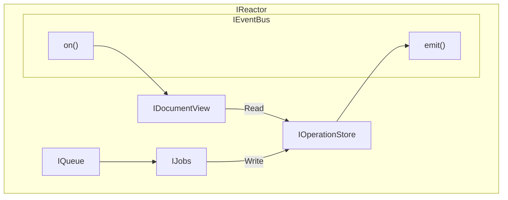

# Refactor v2: Read/Write Split

## Goals:

- Split existing `IDocumentStorage` across read/write boundaries.
- Simplify write storage to store only operations. This will be called the **Operations Store**.
- Simplify read storage, which rehydrates + caches. This will be called the **Document View**.

### High Level Overview:

- **Operations Store**
    - [IOperationStore](../Interfaces%201f31f4740a7f8040a49bc416e7e0766e/Interface%20IOperationStore%201fc1f4740a7f80a9bd57ca809ee55bda.md)
    - A simple storage of events, indexed by sync unit tuple (docId, scope and branch).
    - Minimal query methods to allow hydrating the DocumentViews, so they can rebuild their state when needed.
    - This object does not provide any recovery, ordering, or queuing. Instead, the reactor worries about these concerns.
        - When multiple clients attempt to apply operations to the same document, the reactor is already queuing and waiting for each set of writes to the operation store.
        - The operations store throws named errors on revision mismatch issues. The reactor, already queuing operations, performs operation reordering logic to account for the revision changes.
    - The document header is also stored in the operations store. Changes to the document header are reflected in the operations, so the header is immutable.
- **Document View**
    - [IDocumentView](../Interfaces%201f31f4740a7f8040a49bc416e7e0766e/Interface%20IDocumentView%201fc1f4740a7f8033a40ce160fe362209.md)
    - Builds and caches documents based on operations history. It pulls this history from the `IOperationStore` , which provides a document’s full history.
    - Based on PGLite.
        - Similar schema to the existing Prisma storage adapter, but no separate drive table.
        - 
    - Much of the `IDocumentStorage` interface can move here.
- **Synchronization**
    - [ISyncStore](../Interfaces%201f31f4740a7f8040a49bc416e7e0766e/Interface%20ISyncStore%201fc1f4740a7f80e09ecdd805df1d614c.md)
    - Synchronization is focused on the Operations Store instead of the DocumentView. This would provide a unidirectional flow of data: the queue / jobs would push Operations into the store, the DocumentView would get updates through a subscriber mechanism, and then make higher level decisions about how to rehydrate.

**Effects:**

- We’ll need to turn document-level fields into events.
    - INIT with creation timestamp and initial state
    - SET_META
    - Etc
- We’ll need to embrace eventual consistency at a core level, without relying on a single db to keep both the operations and the sync units in sync.

**Open Questions**

- Does Helia or other IPFS based implementations enable a decentralized Operations Store?
    - We’d need to implement some sort of DAG where each node (operation) references the previous one. Then the most recent node has to be published somewhere.
    - We could also look into existing solutions:
        - [Ceramic streams](https://developers.ceramic.network/docs/protocol/js-ceramic/streams/streams-index), that we already use to store the login credentials