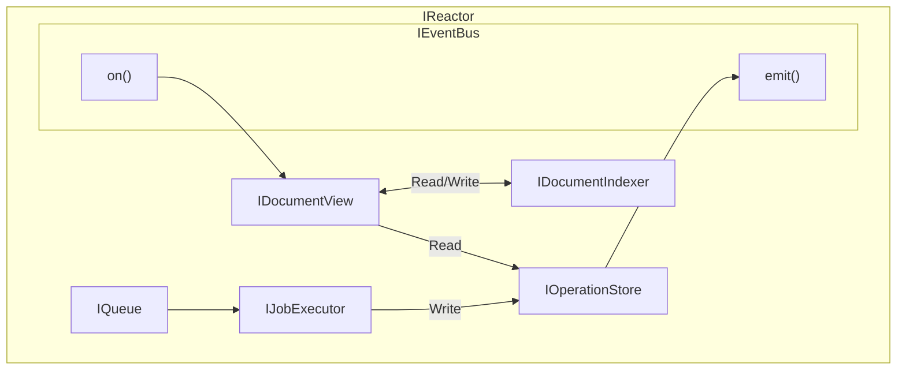

# Interfaces

## Supporting Types

* [Interface](Interfaces/Supporting-Types.md)

**Summary:**

Various types used throughout.

**Dependencies:**

- None

## IEventBus

* [Interface](Interfaces/IEventBus.md)

**Summary:**

The `EventBus` is an async pub/sub mechanism. We can use an event bus to de-duplicate logic. It allows for both async and sync subscriptions to keep operations consistent. This is an in-memory implementation that does not persist events. Each emit() call guarantees each corresponding handler is called, serially.

**Dependencies:**

- None.

## IQueue

* [Interface](Interfaces/IQueue.md)
* [Usage](Interfaces/IQueue-Usage.md)

**Summary:**

The `IQueue` provides a simple API to queue new write jobs. Internally, it creates separate queues keyed by documentId, scope, and branch to ensure proper ordering of operations within each document context. Jobs are processed in FIFO order within each queue to maintain consistency. When jobs are enqueued, the queue emits 'jobAvailable' events to the event bus to notify job executors.

**Dependencies:**

- IEventBus

## IJobExecutor

* [Interface](Interfaces/IJobExecutor.md)
* [Usage](Interfaces/IJobExecutor-Usage.md)

**Summary:**

The `IJobExecutor` listens for 'jobAvailable' events from the event bus and pulls jobs from the queue when capacity allows. It provides configurable concurrency, retry logic with exponential backoff, and monitoring capabilities. The executor ensures jobs are processed in the correct order per document/scope/branch combination.

**Dependencies:**

- IQueue
- IEventBus
- IOperationStore

## IReactorSubscriptionManager

* [Interface](Interfaces/IReactorSubscriptionManager.md)
* [Usage](Interfaces/IReactorSubscriptionManager-Usage.md)

**Summary:**

- Manage relationships between `SearchFilter` and subscriber.
- Provides an explicitly named interface rather than a general one for clarity.
- Consumes the `IEventBus` interface, providing a higher-level abstraction for application developers.

**Dependencies:**

- IEventBus

## IReactor

* [Interface](Interfaces/IReactor.md)
* [Usage](Interfaces/IReactor-Usage.md)

**Summary:**

- Manages DocumentModels and Documents with an asynchronous interface.

**Dependencies:**

- IQueue
- IJobExecutor
- IEventBus
- IDocumentView
- IOperationStore

**Diagram:**

## IReactorClient

* [Interface](Interfaces/IReactorClient.md)
* [Usage](Interfaces/IReactorClient-Usage.md)

**Summary:**

- Wraps several lower-level APIs to provide a simpler interface to users.
- Provides quality-of-life functions for common tasks.
- Wraps Jobs with Promises.
- Wraps subscription interface with `ViewFilter`s. This means that, for example, while the `ISubscriptionManager` only returns ids for create events, the client allows you to specify a view to auto-populate.

**Dependencies:**

- IReactorSubscriptionManager
- IReactor

## Utils

* [Interface](Interfaces/Utils.md)
* [Usage](Interfaces/Utils-Usage.md)

**Summary:**

- Utility functions used throughout.

## IOperationStore

* [Interface](Interfaces/IOperationStore.md)
* [Usage](Interfaces/IOperationStore-Usage.md)

**Summary:**

- Read/write access to raw operations.
- Very important that it has no dependencies on `PHDocument`.
- Very important that all writes are atomic.

**Dependencies:**

- None

## IDocumentView

* [Interface](Interfaces/IDocumentView.md)

**Summary:**

- Listens to `IEventBus` for operation store updates, which trigger it to rebuild / update pre-joined, denormalized views for application reads.
- Reads from `IOperationStore` as needed.
- Provides an API for `IReactor` or external systems to read document data from.

**Dependencies:**

- IOperationStore
- IDocumentIndexer

## IDocumentIndexer

* [Interface](Interfaces/IDocumentIndexer.md)

**Summary:**

- Indexes relationships between documents.

## ISyncStore

* [Interface](Interfaces/ISyncStore.md)

**Summary:**

- Read/write storage for synchronization primitives.