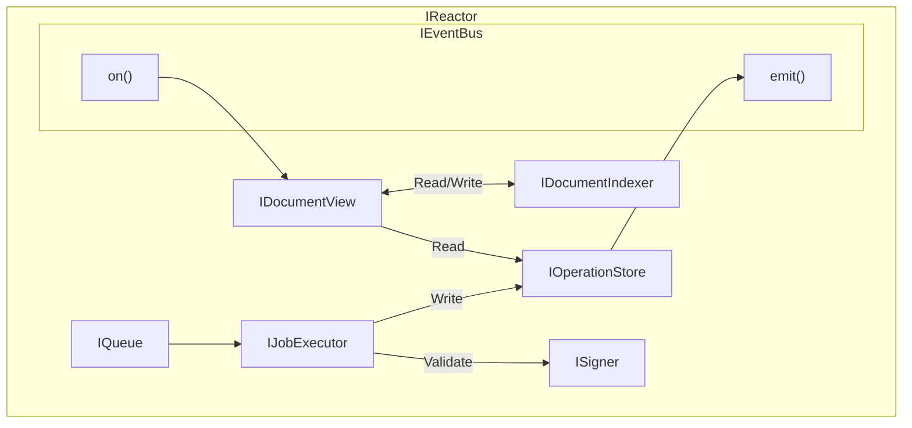

# Diagram

```mermaid
graph TD

    subgraph "IReactor"
        AQueue["IQueue"] --> AJobs["IJobExecutor"] -->|"Write"| AOS["IOperationStore"]
        AJobs -->|"Validate"| ISigner
        AOS --> APub

        subgraph AEvents["IEventBus"]
            APub["emit()"]
            ASub["on()"]
        end

    
        ASub --> ARM["IDocumentView"] <-->|"Read/Write"| IDocumentIndexer
        ARM -->|"Read"| AOS
    end

```
