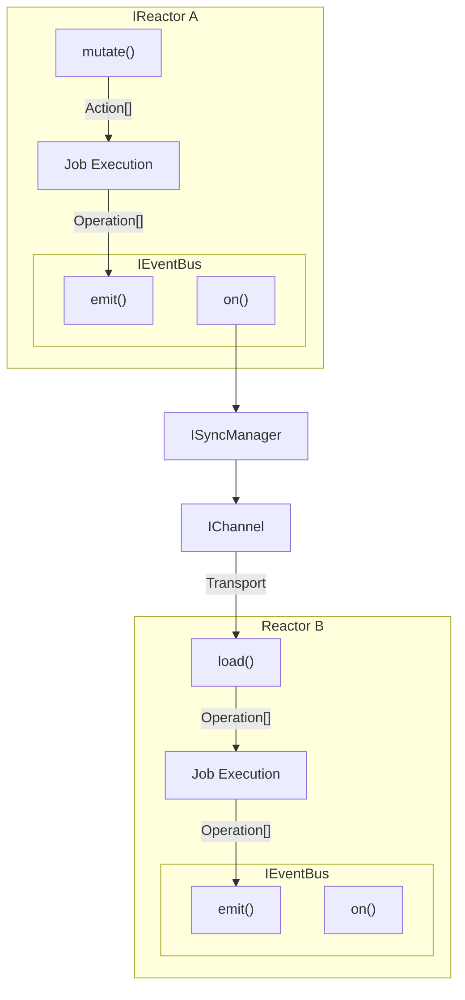
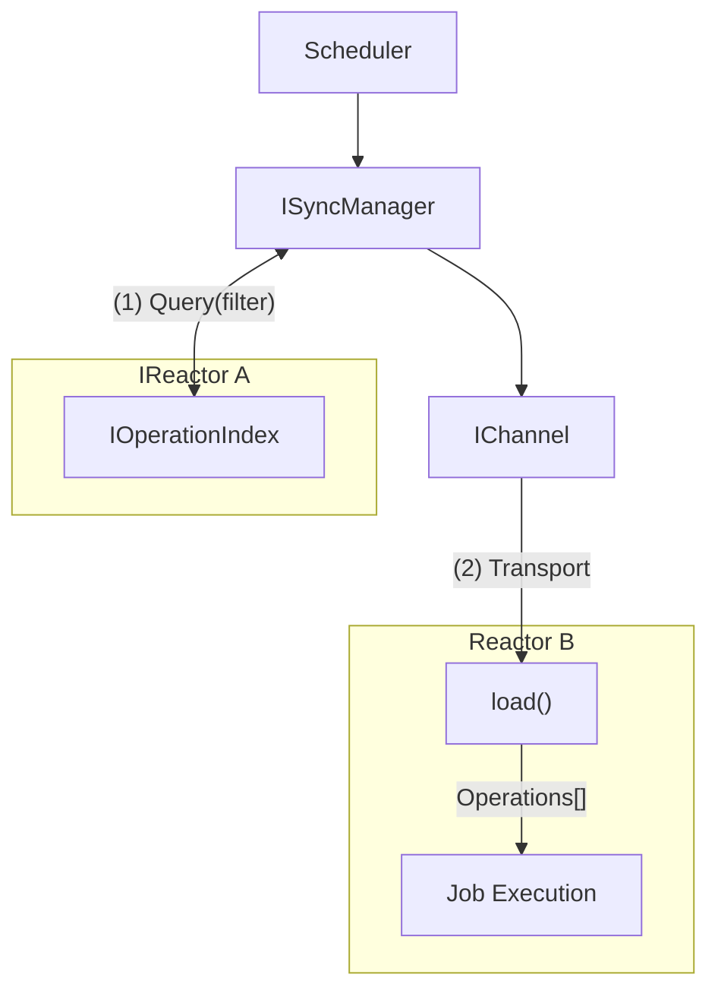
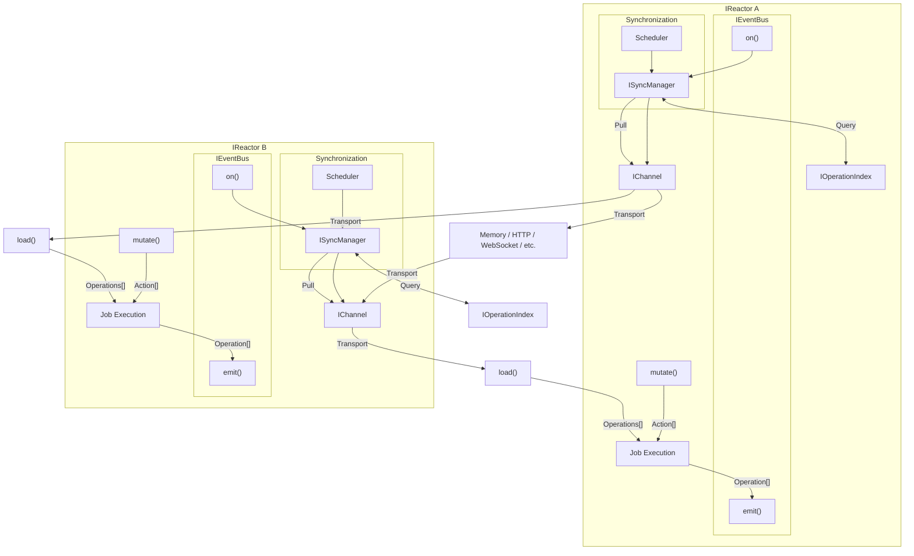
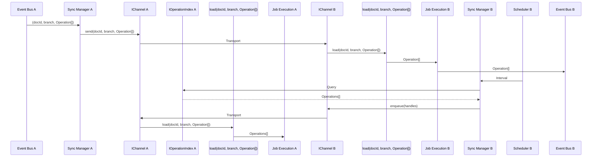

# Synchronization

Synchronization refers to synchronizing the operations of one reactor with another. This is a key part of the Reactor architecture.

- We focus on synchronizing the `IOperationStore`, and bubbling outward.
  - This allows us to decouple sync and read-model updates.
  - This consolidates multiple legacy systems into a single dispatch pattern.

We synchronize the `IOperationStore` by pulling from the `IOperationIndex`, which contains good, fast cursors for operations.

## ISyncManager

This object manages the synchronization of operations between reactors.

The `ISyncManager` has its own storage mechanism and rather than being tied so the internal mechanisms of the Reactor, propagates from the event bus.

### Push

Describes a one-way flow of data from one Reactor to another, pushing operations through an `IChannel` interface.



### Pull

Describes a one-way flow of data from one Reactor to another, pulling operations through an `IChannel` interface on an interval.



Here we introduce the concept of a "filter" for queries. These consist of a collection id, a cursor, and a `ViewFilter`. Collection ids are **always** computed via the `driveCollectionId(branch, driveId)` helper (implemented alongside the operation-index types) so today only drive documents can act as collection roots and every cursor derives from those drives. Remote filters supplied by callers are decomposed into one or more concrete remote queries by the sync manager using this same helper plus the provided `ViewFilter`. If a filter cannot be expressed as a set of drive-derived collection ids (for example, "watch this single non-drive document"), the manager must throw during `add()` or `setFilter()` so that every remote ultimately operates on well-defined collection cursors.

The cursor is a monotonically increasing integer that represents the ordinal of the last operation that was processed.

The `ViewFilter` is a standard `ViewFilter` object, as described in the [Shared interface](../Shared/interface.md) documentation.

#### `IOperationIndex`

`IOperationIndex` (see [Operation Index](../Cache/operation-index.md)) flattens the operations of every document in a collection into a single, ordinal-ordered stream. Inside each job executor we write both to the `IOperationStore` (authoritative log) and to the index, so the index behaves like a write model: it participates in the same transaction, rolls back if the store write fails, and exposes the same ordering guarantees to consumers. The pull loop relies on those properties:

- **Collection cursors.** Each remote/remote-filter keeps a cursor (ordinal) into the index. Collections represent “documents ever attached to a drive”, so a remote that subscribes to an entire drive advances one cursor instead of tracking every `(documentId, scope, branch)` tuple.
- **Filter projection.** The index stores document metadata (type, identifiers) alongside the operations table described in the index spec. The `"(1) Query(filter)"` arrow means the sync manager asks, “give me all operations since ordinal N for collection C matching my remote filter.” We never have to replay documents just to check filters, and channels never talk to the index directly.
- **No read-model lag.** Because the index is written synchronously with the job executor (Option #1 in the index doc), pull latency is bounded by network time. If we ever switch to async/index-lag mode we must document the reconciliation/catch-up process here.
- **IOperationStore fallback.** When reconciliation detects a gap (`MISSING_OPERATIONS`), the sync manager can fall back to `IOperationStore.getSince` to rebuild a strand—but the steady-state pull path never hits the store directly; it streams from the index.

Algorithmically, when the scheduler fires:

1. `ISyncManager` reads the remote’s stored (filter, cursor) pairs.
2. It queries `IOperationIndex` using the `find` method (`find(collectionId, cursor, view, paging)`), receiving ordered operations plus the new ordinal.
3. The results are wrapped in `MutableJobHandle`s and placed into the channel inbox so the channel can transport them to the remote reactor.

If a remote only tracks a handful of documents, we still leverage the index by building a logical collection over that document set and keeping an ordinal per remote-filter pair. The important point is that the pull architecture is defined in terms of the index, not by directly scanning the operation store.

### Ping-Pong

Since both `Push` and `Pull` are one-way flows, we combine them into a ping-pong pattern. This is where both reactors are pushing and pulling through the `IChannel` interface.

The schedulers are "smart" and understand how to optimimally set intervals based on a number of factors, including:

- Operation characteristics (size, frequency, etc.)
- Network characteristics (latency, bandwidth, etc.)
- Reactor characteristics (CPU, memory, etc.)
- Recent pushes from other reactor

*Coordinated backpressure and fairness across remotes is tracked as a future improvement; the initial implementation only tracks health metrics and simple interval tuning.*


### Ping-Pong: Sequence



## IChannel

The `IChannel` interface is a bi-directional interface for sending, receiving, and tracking operations. We do this with `inbox` and `outbox` queues of `JobHandle` objects. Each handle tracks a job that is being applied by a server (local or remote, depending on the mailbox).

### Usage

```tsx
const channel = new WebSocketChannel();

// when something is added to our inbox...
channel.inbox.onAdded(async (handle) => {
  // create a job from the handle
  const job = createJob(handle);

  // queue the job for execution
  await queue.enqueue(job);

  // watch for local job completion
  const result = await jobs.watch(job.id);

  // set status
  if (result.error) {
    handle.failed(
      new ChannelError(ChannelErrorSource.Inbox, result.error))
  } else {
    handle.executed();
  }
});

// when something is added to our outbox...
channel.outbox.onAdded((job) => {
  console.log(
    `Remote server is applying ${job.operations.length} operations...`,
  );

  // eg - update progress indicator or status bar
});

// when something is removed from our outbox...
channel.outbox.onRemoved((job) => {
  console.log(
    `Remote server has applied ${job.operations.length} operations...`,
  );

  // eg - update progress indicator or status bar
});

// when a job has permanently failed to be applied...
channel.deadLetter.onAdded((job) => {
  console.log(`Job ${job.id} has failed to be applied...`);
});

// listen for local job completion
events.on(JobExecutorEventTypes.JOB_COMPLETED, (job, result) => {
  // is this a job in our inbox?
  const handle = channel.inbox.get(job.id);
  if (handle) {
    handle.executed();

    // the channel will remove it from the inbox queue

    return;
  }

  // this isn't a job from another reactor, instead we need to send it to the remote server
  channel.send(job.documentId, job.branch, job.operations);
});
```

### Acknowledgement Flow

Channels must provide an explicit acknowledgement (ACK) protocol so that both sides agree when a job has been durably applied. The flow is:

1. The sending reactor enqueues operations into its `outbox`. Each `JobHandle` contains the `remoteName`.
2. The receiving reactor dequeues a `MutableJobHandle` from its `inbox`, executes it locally, and once `JobExecutorEventTypes.JOB_COMPLETED` fires without error it emits an ACK back across the channel that references the original job id and remoteName.
3. Upon receiving the ACK, the sender removes the handle from its `outbox`, advances any remote cursor, and updates the remote’s health counters in `sync_remotes`.
4. If execution fails, the receiver emits a NACK (negative acknowledgement) with the error payload so the sender can move the handle into the `deadLetter` mailbox and apply retry/disable policy.

Transport implementations (HTTP, WebSocket, in-memory) are responsible for guaranteeing ordered ACK/NACK delivery per remote. Without an ACK the sender must assume the job was not applied and retry according to channel policy; duplicate ACKs are idempotent because the `JobHandle` is removed only once.

### Retries

The `IChannel` implementation is responsible for retrying failed push and pull operations due to network conditions. Implementations should use exponential backoff with jitter when applicable, according to a retry policy.

Network errors should not bubble up from the `IChannel` unless the retry policy is exhausted.

Transport failures (connection drops, TLS errors, broker disconnects, etc.) flow through this same retry/disable pathway: the channel records them as `ChannelErrorSource.Channel`, increments the remote’s health counters, and once retries are exhausted the sync manager disables the remote just like any other fatal error.

### Consistency Tokens

Consistency tokens are strictly a local read-model coordination tool (see [Jobs](../Jobs/index.md)). Sync never transmits or interprets those tokens; once operations have been transported, each reactor’s own read models are responsible for waiting on their tokens independently.

### Optimization

The `IChannel` implementation is free to optimize in a number of ways. For instance, it may batch `push` operations and send them in the `pull` request. Over HTTP, for example, this would result in a single `pull` request that will decompose nicely when there is no socket available.

## Error Handling

The synchronization system must have a robust error handling strategy. All possible errors must be explicitly defined here with a clear description of the error, the conditions under which it occurs, and recovery strategies.

### `IChannel`

`IChannel` implementations communicate errors in one single way: the `error` object on `JobHandle` objects in the `deadLetter` mailbox. Every error that can occur in a channel is communicated to the consumer of the channel through this mailbox.

For example:

```tsx
const channel = new WebSocketChannel();

channel.deadLetter.onAdded((job) => {
  // inspect error
  const error = job.error;
  const source = error.source;

  // handle ...
});
```

The `ChannelError` object has a `source` property that indicates the source of the error (could be inbox, outbox, or channel).

The `error` property can be one of two types:

- **JobError** - these are propagated job execution errors, documented in the [Jobs interface](../Jobs/interface.md).
- **InternalChannelError** - these are errors from the channel itself, not the job.

### Job Errors

#### `SIGNATURE_INVALID`

##### ChannelErrorSource.None

This is not a valid source for this error code, and should never happen. However, in the case that this does happen:

- The job will be logged as an error.
- The job will be removed from the inbox queue.

##### ChannelErrorSource.Inbox

This indicates that a remote operation could not be applied to the local reactor because of a signature mismatch. This should never happen _except in the case of a malicious actor_, as remote reactors are already validating signatures.

In the case that this does happen:

- The remote will be marked as invalid and no further operations will be sent to or received from it.
- The job will be removed from the inbox queue.

##### ChannelErrorSource.Outbox

This indicates that a local operation could not be applied to the remote reactor because of a signature mismatch. This means that while we were able to verify a signature, the remote was not. This is an unrecoverable error, signaling a problem with a remote reactor itself:

- The remote will be marked as invalid and no further operations will be sent to or received from it.
- The job will be removed from the outbox queue.

#### `HASH_MISMATCH`

##### ChannelErrorSource.None

This is not a valid source for this error code, and should never happen. However, in the case that this does happen:

- The job will be logged as an error.
- The job will be removed from the inbox queue.

##### ChannelErrorSource.Inbox

This indicates that a remote operation could not be applied to the local reactor because of an unrecoverable hash mismatch (note that retry/reshuffle has already been attempted). In this case:

- Create a branch at the last known good state.
- Re-apply the operation to the branch.
- Push the branch to the remote reactor.

##### ChannelErrorSource.Outbox

This indicates that a local operation could not be applied to the remote reactor because of a hash mismatch. This case should be handled by the receiving Reactor. In this case:

- The job will be discarded.

#### `LIBRARY_ERROR`

##### ChannelErrorSource.None

This is not a valid source for this error code, and should never happen. However, in the case that this does happen:

- The job will be discarded.

##### ChannelErrorSource.Inbox

This indicates that an error occurred in job execution locally, but not remotely. In this case:

- Create a branch at the last known good state.
- Re-apply the operation to the branch.
- Push the branch to the remote reactor.

##### ChannelErrorSource.Outbox

This indicates that an error occurred in job execution remotely, but not locally. The receiving Reactor should handle this case. In this case:

- The job will be discarded.

#### `MISSING_OPERATIONS`

##### ChannelErrorSource.None

This is not a valid source for this error code, and should never happen. However, in the case that this does happen:

- The job will be discarded.

##### ChannelErrorSource.Inbox

This would mean that a local reactor is trying to submit an operation with a later operation index than the latest local index. In this case:

- The job will be discarded.

##### ChannelErrorSource.Outbox

This would mean that we received an operation with a later index than the latest we have locally. In this case:

- We must pull the missing operations fromt the remote reactor.

#### `EXCESSIVE_SHUFFLE`

##### ChannelErrorSource.None

This is not a valid source for this error code, and should never happen. However, in the case that this does happen:

- The job will be discarded.

##### ChannelErrorSource.Inbox

This would mean that a local reactor is trying to submit an extremely out of date `Action`. In this case:

- Get latest operations from the remote reactor.
- Rebase locally.
- The action needs to be updated with the latest index and re-queued as a new job.

##### ChannelErrorSource.Outbox

This would mean that a remote reactor is trying to submit an extremely out of date `Action`. In this case:

- Notify the remote reactor that their operation has been rejected and they must locally rebase before resubmitting.

#### `GRACEFUL_ABORT`

For all sources, the `ISyncManager` will simply ignore and discard, allowing the system to catchup on next startup.

### Channel Errors

Channel errors will be documented here, depending on the implementation of the `IChannel` interface.

```tsx
class UnrecoverableRemoteError extends Error {
  /**
   * The name of the remote that is unrecoverable.
   */
  remote: string;

  /**
   * The error that occurred.
   */
  error: Error;
}
```
