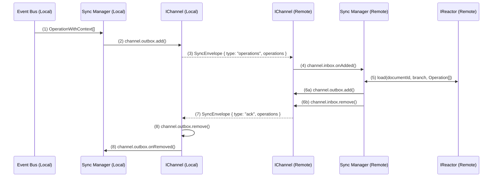
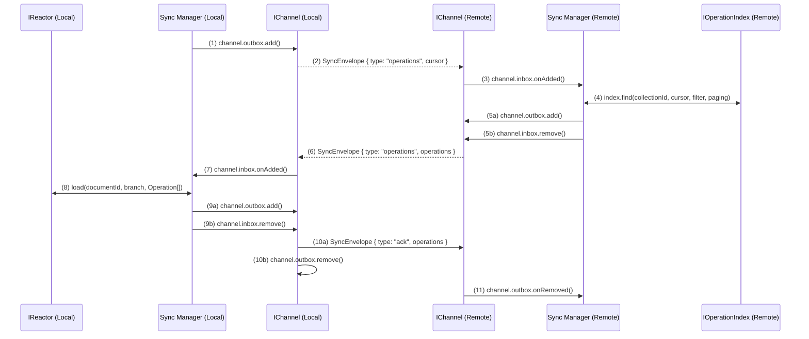
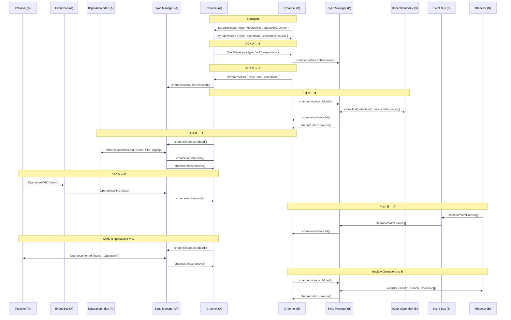
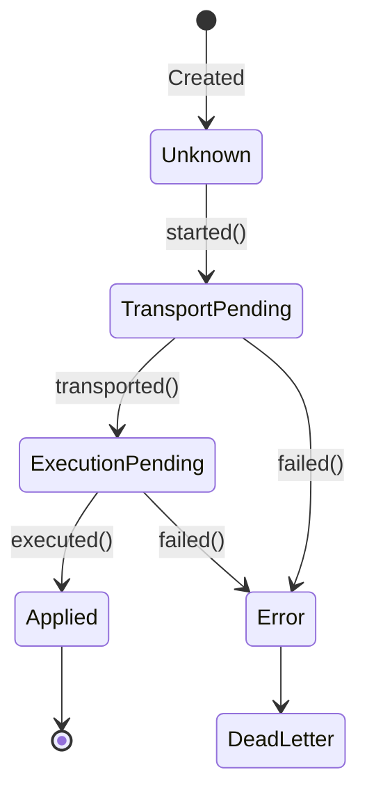

# Reactor Synchronization Specification

## Table of Contents

- [Layer 1: Overview & Conceptual Model](#layer-1-overview--conceptual-model)
- [Layer 2: Protocol Specification](#layer-2-protocol-specification)
- [Layer 3: Implementation Details](#layer-3-implementation-details)
- [Appendix: Legacy to New Concept Mapping](#appendix-legacy-to-new-concept-mapping)

---

# Layer 1: Overview & Conceptual Model

## Introduction

Reactor synchronization enables distributed operation-based collaboration between autonomous reactor instances. Operations (representing state mutations) flow bidirectionally through channels, maintaining eventual consistency while preserving causal ordering and supporting offline/online transitions.

This specification unifies two perspectives:

- **Conceptual granularity** (strand/thread/cable taxonomy) — helps reason about what we're synchronizing
- **Implementation optimization** (collection-based streams) — makes it efficient and scalable

## Core Concepts

Prerequisite reading:

- [Operations](../Operations/index.md)
- [IOperationStore](../Storage/IOperationStore.md)

### What Are We Synchronizing?

At the heart of synchronization is the **operation stream** — a totally-ordered stream of operations that, when reduced, produces a document's current state. In the storage layer (`IOperationStore`), every operation stream is identified by a triple:

```
(documentId, scope, branch)
```

At the synchronization layer, we add routing metadata to determine where operations flow to/from:

```
(remote, documentId, scope, branch)
```

Where **remote** is synchronization-layer metadata (not part of the storage identity) that specifies the destination or source reactor instance.

**Key properties:**
- Operations within a stream are **append-only** with monotonically increasing indices
- Each operation carries a **state hash** for verification
- Operations may be **skipped or undone** through the skip parameter mechanism
- Streams are **causally ordered** — operations depend on all preceding operations in the same stream

### Synchronization Granularity: Strand, Thread, Cable

We define three levels of synchronization granularity that compose hierarchically:

#### 1. Synchronization Strand

The most granular level on which synchronization logic is defined is the **strand**. A strand is a synchronization-layer concept that represents the flow of operations for a single storage-layer stream between two reactor instances:

```
Storage stream: (documentId, scope, branch)
Synchronization flow: remote₁ → remote₂
```

Or more explicitly:

```
(remote₁, documentId₁, scope₁, branch₁) → (remote₂, documentId₂, scope₂, branch₂)
```

Where `remote₁` and `remote₂` identify the source and destination reactor instances.

**Properties:**
- All synchronization behavior (conflict detection, cursor tracking, ACK/NACK) is defined at strand granularity
- A strand maps operations from a single storage stream `(documentId, scope, branch)` in the source `IOperationStore` to the destination `IOperationStore`
- The remote identifiers determine routing but are not part of the operation stream identity in storage

**Example:** Synchronizing the `main` branch of the `public` scope of document `doc-123` from Drive A to Drive B creates one strand that flows operations from one reactor's storage to another's.

#### 2. Synchronization Thread

A **document-level** synchronization channel. A thread synchronizes one or more storage streams (identified by different scopes/branches) for the same document, flowing from one remote to another:

```
Storage streams: (documentId, scope*, branch*)
Synchronization flow: remote₁ → remote₂
```

Or more explicitly:

```
(remote₁, documentId₁, ?, ?) → (remote₂, documentId₂, ?, ?)
```

**Thread types:**
- **Single-document thread:** `documentId₁ = documentId₂` (default, most common)
- **Cross-document thread:** `documentId₁ ≠ documentId₂` (for templates or copies)
- **Complete thread:** Synchronizes all scopes and branches of a document (leads to identical document instances)
- **Partial thread:** Synchronizes a subset of scopes/branches (e.g., only `public` scope or only `main` branch)

**Example:** Synchronizing both `public` and `protected` scopes of document `doc-123` from Drive A to Drive B creates a thread containing two strands (assuming one branch each).

#### 3. Synchronization Cable

A **drive-level** synchronization channel. A cable synchronizes multiple storage streams (for multiple documents) between two reactor instances:

```
Storage streams: (documentId*, scope*, branch*)
Synchronization flow: remote₁ → remote₂
```

Or more explicitly:

```
(remote₁, ?, ?, ?) → (remote₂, ?, ?, ?)
```

**Cable types:**
- **Complete cable:** Synchronizes all documents, scopes, and branches (leads to identical drive instances)
- **Partial cable:** Synchronizes a filtered subset (e.g., only public documents, only specific document types)

**Example:** Synchronizing all public documents from Drive A to Drive B creates a cable containing many threads (one per document).

### Collection-Based Optimization

While strand/thread/cable provide conceptual clarity, **collections** provide implementation efficiency.

The `IOperationStore` stores operation streams identified by `(documentId, scope, branch)` tuples (see the [getSince()](../Storage/IOperationStore.md#interface) method). Each storage stream can be synchronized as a strand by adding remote routing information at the sync layer. Therefore, `IOperationStore` can easily support strand synchronization.

To support thread synchronization, we can use `getSince` to query across multiple scopes.

However, to support cable synchronization, we would need to make an arbitrary number of queries: one for the drive url, then at least one for each document contained in the drive. This is why we need to introduce the notion of **collections** (see [operation-index-membership-plan.md](../Cache/operation-index-membership-plan.md) for how collections remember every document that has ever belonged to a drive while still emitting operations only for the intervals when the membership was active).

A **collection** is a flattened stream of threads. This means that, given a set of threads `T = {(driveId, docId, scope, branch) | driveId = d}` for some constant `d`, a collection reduces `T` to a single ordered stream of operations by merging all operations from threads in `T`. We can then keep a single cursor for `T`, rather than a cursor for every element of `T`.

Practically, the job executor uses the [`IOperationIndex`](../Cache/operation-index.md) to forward-create collections as operations are executed. While, technically, arbitrary collections could be created, at first, the job executor will create collections based only on `document-drive` model creation:

```ts
const txn = index.start();

// elided

if (documentType === "powerhouse/document-drive") {
  // the driveCollectionId helper is defined in src/cache/operation-index-types.ts
  collectionId = driveCollectionId(branch, documentId)
  txn.createCollection(collectionId);
}

// elided

await index.commit(txn);
```

> Future iterations of this system will introduce a new action, like CREATE_COLLECTION. This would explicitly tell the job executor to create a collection, rather than requiring core components to reference specific document models. This would also allow any other document model to have children.

The job executor then updates the collection based on relationship actions:

```ts
if (operation.action.type === "ADD_RELATIONSHIP") {
  index.addToCollection(
    driveCollectionId(branch, parentId),
    documentId,
    ordinal,
  );
} else if (operation.action.type === "REMOVE_RELATIONSHIP") {
  index.removeFromCollection(
    driveCollectionId(branch, parentId),
    documentId,
    ordinal,
  );
}
```

This means that when specifying remotes (described later), there will be a 1:1 correlation between a remote and a **drive cable**. This will be done with the `driveCollectionId` function on both ends: the job executor will use it to create the collections, and other reactors will have to use it to create remotes with the correct `collectionId`.

**Key insight:** Instead of tracking cursors for many individual strands `(remote, documentId, scope, branch)`, we track a single cursor per `collectionId` (this is shown below by a 1:1 correspondence between a `Remote` and a `collectionId`). Because collection membership records include both the “join” and “leave” ordinals (see the membership plan), that cursor will automatically skip operations that occurred outside the membership window even though historical membership is still available for audit queries.

**Example:** A cable synchronizing Drive A (100 documents) to Drive B requires only one cursor per branch rather than 100+ strand-level cursors.

## Synchronization Patterns

Now that we have an understanding of strands/threads/cables and collections, we can describe the high level synchronization sequence.

**Requisites:**
- There is one `IChannel` per `(remote, collectionId)` tuple.
- The `ISyncManager` is responsible for mapping operations to appropriate channels. It does this by reading meta information on `OperationWithContext`.
- Each `IChannel` is responsible for managing and storing its own cursor.
- Cursors can be updated using outgoing and incoming operations.

### `SyncEnvelope`

The `SyncEnvelope` object (defined below), contains a `type` field that indicates whether the envelope contains `operations` or an `ack`. These two are semantically distinct, as `operations` envelopes need to wait for an ACK, but `ack` envelopes do not.

### Push Pattern

**Trigger:** Sender-initiated (event-driven)

**Example:** A user checks a box in a document model editor, which applies some action, like `SET_FLAG`.

**Flow:**


### Pull Pattern

**Trigger:** Receiver-initiated (scheduled, cursor-based)

**Example:** A reactor regularly polls the remote for new operations.
**Example:** A reactor starts up and pulls all operations from the remote to catch up.
**Example:** A reactor is offline for a period of time and needs to catch up.

**Flow:**


### Ping-Pong Pattern

The ping-pong pattern composes push and pull patterns. You can see this broken into Push, Pull, and ACK flows. Also notice that the `SyncEnvelope` object is able to compose both cursor and operations flows in a single envelope: the former used for pull, the latter used for push.

**Trigger:** Bidirectional (both push and pull)

**Example:** Two reactors are pushing and pulling operations to keep in sync.

**Flow:**



# Layer 2: Protocol Specification

## Synchronization Primitives

### `OperationWithContext`

This is the primitive we are synchronizing. It is passed back and forth between reactors.

This object is defined in [src/storage/interfaces.ts](../../src/storage/interfaces.ts) and looks something like this:

```ts
export type OperationContext = {
  documentId: string;
  documentType: string;
  scope: string;
  branch: string;
  resultingState?: string; // populated only locally, in memory
};

export type OperationWithContext = {
  operation: Operation;
  context: OperationContext;
};
```

### `Remote`

```ts
type RemoteOptions = {
  // future configuration options
};

type RemoteFilter = {
  /**
   * Array of document ids. If specified, this further refines documents in a
   * collection.
   */
  documentId: string[];

  /** Array of operation scopes to include, use ["*"] for all */
  scope: string[];

  /** Branch to filter for. Use "main" for default behavior. */
  branch: string;
};

type Remote = {
  /** The name of the remote. Must be unique. Intended to be human
   * readable, but does not affect anything.
   */
  name: string;

  /** The id of the collection this remote is tracking */
  collectionId: string;

  /** Applies additional filtering on top of collections, generally in memory */
  filter: RemoteFilter;

  /** Options for the remote */
  options: RemoteOptions;

  /** The channel connected to this remote */
  channel: IChannel;
};
```

**Remote semantics:**
- Remotes are 1:1 with collections
- Remotes may have additional filtering logic on them through `RemoteFilter`

### `RemoteCursor`

A cursor tracks progress through a collection. This object is passed back and forth and also stored for catchup.

```typescript
type RemoteCursor = {
  remoteName: string;         // Which remote owns this cursor
  cursorOrdinal: number;      // Last processed ordinal (exclusive)
  lastSyncedAtUtcMs?: number; // Timestamp of last sync (which may have been push or pull)
};
```

**Cursor semantics:**
- Cursors are **exclusive** — the next query starts at `cursorOrdinal + 1`
- Cursors are **per-remote**

### `SyncEnvelope`

The `SyncEnvelope` is the object sent/received by the transport layer. In general, this will travel over HTTP, but other transport layers are possible.

The `ChannelMeta` contains metadata that identifies the channel and its configuration.

```ts
type ChannelMeta = {
  id: string; // unique identifier for the channel, probably a UUID
};

type SyncEnvelopeType = "operations" | "ack";

type SyncEnvelope = {
  type: string;
  channelMeta: ChannelMeta;
  operations?: OperationWithContext[];
  cursor?: RemoteCursor;
};
```

## Channel Model

### `IChannel`

Every `IChannel` has three mailboxes that hold `SyncOperation` objects (which are defined below):

1. **Inbox:** Operations received from remote (awaiting local execution)
2. **Outbox:** Operations sent to remote (awaiting remote confirmation)
3. **DeadLetter:** Operations that failed permanently (retry exhausted, fatal error)

```ts
interface IChannel {
  /**
   * The incoming queue of operations that need to be applied to the local reactor.
   */
  inbox: Mailbox<SyncOperation>;

  /**
   * The outgoing queue of operations being applied to the remote reactor.
   */
  outbox: Mailbox<SyncOperation>;

  /**
   * The dead letter queue of operations that have failed for any reason.
   */
  deadLetter: Mailbox<SyncOperation>;
}
```

### `Mailbox`

Each mailbox contains a set of objects, and dispatches when objects are added and removed.

```ts
class Mailbox {
  /**
   * The items in the mailbox.
   */
  get items(): ReadonlyArray<JobHandle>;

  /**
   * Gets an item from the mailbox.
   */
  get(id: string): JobHandle | undefined;

  /**
   * Adds an item to the mailbox.
   */
  add(item: JobHandle): void;

  /**
   * Removes an item from the mailbox.
   */
  remove(item: JobHandle): void;

  /**
   * Subscribes to new items being added to the mailbox.
   */
  onAdded(callback: (item: JobHandle) => void): void;

  /**
   * Subscribes to items being removed from the mailbox.
   */
  onRemoved(callback: (item: JobHandle) => void): void;
}
```

### `SyncOperation`

The `SyncOperation` is the mutable data structure that tracks execution of a set of operations through the sync pipeline.

```ts
enum SyncOperationStatus {
  /** The sync operation status is not known */
  Unknown = -1,

  /** The sync operation is being transported */
  TransportPending,

  /** The sync operation is being executed */
  ExecutionPending,

  /** The sync operation has been applied */
  Applied,

  /** The sync operation has failed */
  Error,
}

enum ChannelErrorSource {
  None = "none",
  Channel = "channel",
  Inbox = "inbox",
  Outbox = "outbox",
}

class InternalChannelError extends Error {
  // ...
}

class ChannelError extends Error {
  /**
   * The source of the error.
   */
  source: ChannelErrorSource;

  /**
   * The error that occurred.
   */
  error: Error;

  constructor(source: ChannelErrorSource, error: Error) {
    super(`ChannelError[${source}]: ${error.message}`);

    this.source = source;
    this.error = error;
  }
}

class SyncOperation {
  /** The unique id of the sync operation */
  id: string;

  /** Remote name associated with this sync operation (source for inbox, destination for outbox) */
  remoteName: string;

  /** The document id that the sync operation is operating on */
  documentId: string;

  /** The scopes affected */
  scopes: string[];

  /** The branch that the sync operation is operating on */
  branch: string;

  /** The operations */
  operations: OperationWithContext[];

  /** The status of the sync operation */
  status: SyncOperationStatus = SyncOperationStatus.Unknown;

  /** The error that occurred, if any */
  error?: ChannelError;

  /**
   * Subscribes to changes in the sync operation status.
   */
  on(
    callback: (
      syncOp: SyncOperation,
      prev: SyncOperationStatus,
      next: SyncOperationStatus,
    ) => void,
  ): void;

  /**
   * Moves sync operation from Unknown to TransportPending.
   */
  started(): void;

  /**
   * Moves sync operation from TransportPending to ExecutionPending.
   */
  transported(): void;

  /**
   * Moves sync operation from ExecutionPending to Applied.
   */
  executed(): void;

  /**
   * Moves sync operation from any state to Error.
   */
  failed(error: ChannelError): void;
}
```

A `SyncOperation` represents a unit of work (one or more operations for a single document/branch):



**State transitions:**
- `Unknown` → `TransportPending`: Sync operation entered channel, transport layer activated
- `TransportPending` → `ExecutionPending`: Sync operation sent, queued for execution
- `ExecutionPending` → `Applied`: Sync operation executed successfully, operations appended to history
- Any state → `Error`: Failure occurred (signature invalid, hash mismatch, library error, etc.)

### ACK Protocol

The ACK flow is described in Pull, Push, and Ping-Pong flows above. Essentially, the receiver sends an ACK, which removes the sync operation from the outbox of the original sender. It indicates an ACK by using the `type` field of the `SyncEnvelope`.

## Error Handling and Recovery

### Error Taxonomy

Errors are categorized by **source** and **type**:

```typescript
enum ChannelErrorSource {
  None = "none",         // Error origin unknown
  Channel = "channel",   // Transport/network error
  Inbox = "inbox",       // Error applying received operations
  Outbox = "outbox"      // Error sending operations
}

type JobErrorType =
  | "SIGNATURE_INVALID"
  | "HASH_MISMATCH"
  | "LIBRARY_ERROR"
  | "MISSING_OPERATIONS"
  | "EXCESSIVE_SHUFFLE"
  | "GRACEFUL_ABORT";
```

### Error Handling Matrix

| Error Type | Source: Inbox | Source: Outbox | Source: Channel |
|---|---|---|---|
| **SIGNATURE_INVALID** | Mark remote invalid, disable remote | Mark remote invalid, disable remote | N/A |
| **HASH_MISMATCH** | Create branch, reapply operation, push to remote | Discard sync operation (remote handles) | N/A |
| **LIBRARY_ERROR** | Create branch, reapply operation, push to remote | Discard sync operation (remote handles) | N/A |
| **MISSING_OPERATIONS** | Discard sync operation | Pull missing operations, resend | N/A |
| **EXCESSIVE_SHUFFLE** | Pull latest, rebase, re-queue as new sync operation | Notify remote to rebase | N/A |
| **GRACEFUL_ABORT** | Discard, catch up next cycle | Discard, catch up next cycle | Discard, catch up next cycle |
| **Transport Failure** | N/A | N/A | Retry with backoff, then disable |

### Retry Policy

**Exponential backoff with jitter:**
```
retryDelayMs = min(maxDelay, baseDelay * 2^failureCount + jitter)
```

**Default values:**
- `baseDelay` = 1000ms
- `maxDelay` = 300000ms (5 minutes)
- `maxRetries` = 5

**Failure threshold:**
- After 5 consecutive failures, remote is marked as `error` state
- User intervention required to re-enable (or automatic re-enable after health check)

### Health Tracking

```typescript
type ChannelHealth = {
  state: "idle" | "running" | "error";
  lastSuccessUtcMs?: number;
  lastFailureUtcMs?: number;
  failureCount: number;
};

type RemoteStatus = {
  push: ChannelHealth;
  pull: ChannelHealth;
};
```

**State transitions:**
- `idle` → `running`: Sync operation started
- `running` → `idle`: Sync operation succeeded
- `running` → `error`: Sync operation failed after retries exhausted
- `error` → `idle`: User re-enabled remote or health check passed

---

# Layer 3: Implementation Details

## Core Interfaces

### ISyncManager

The orchestrator for all synchronization activity.

```typescript
type ChannelConfig = {
  /**
   * The type of the channel.
   */
  type: string;

  /**
   * Parameters for the channel.
   */
  parameters: Record<string, any>;
}

interface ISynchronizationManager {
  /**
   * Starts the synchronization manager. This recreates remotes and preps for catch up.
   *
   * @returns Promise that resolves when the manager is started
   */
  startup(): Promise<void>;

  /**
   * Shuts down the synchronization manager. This cleans up resources and stops all synchronization.
   */
  shutdown(): ShutdownStatus;

  /**
   * Get details of a specific remote
   *
   * @param name - The name of the remote
   * @returns The remote
   */
  get(name: string): Remote;

  /**
   * Add a new remote
   *
   * @param name - The name of the remote
   * @param collectionId - The collection id to use for this remote
   * @param channelConfig - The configuration for the channel to use for this remote
   * @param filter - The filter to use for this remote
   * @param options - The options for this remote
   * @returns The remote
   */
  add(
    name: string,
    collectionId: string,
    channelConfig: ChannelConfig,
    filter?: RemoteFilter,
    options?: RemoteOptions,
  ): Promise<Remote>;

  /**
   * Remove an existing remote
   *
   * @param name - The name of the remote
   * @returns The remote
   */
  remove(name: string): Promise<void>;

  /**
   * List all configured remotes
   *
   * @returns The remotes
   */
  list(): Remote[];
}

interface IChannelFactory {
  /**
   * Creates a new instance of the channel.
   *
   * @param config - The configuration for the channel
   * @param cursorStorage - The cursor storage to use for the channel
   * @returns The channel
   */
  instance(config: ChannelConfig, cursorStorage: ISyncCursorStorage): IChannel;
}
```

### ISyncRemoteStorage

Durable storage for remote metadata. The `ISyncManager` owns this object, re-creates objects on `startup()`, and persists changes based on remote add/remove.

Initial implementations will simply be in-memory.

```typescript
type RemoteRecord = {
  name: string;
  collectionId: string;
  channelConfig: ChannelConfig;
  filter: RemoteFilter;
  options: RemoteOptions;
  status: RemoteStatus;
};

interface ISyncRemoteStorage {
  /**
   * Lists all remotes.
   *
   * @param signal - Optional abort signal to cancel the request
   * @returns The remotes
   */
  list(signal?: AbortSignal): Promise<RemoteRecord[]>;

  /**
   * Gets a remote by name.
   *
   * @param name - The name of the remote
   * @param signal - Optional abort signal to cancel the request
   * @returns The remote
   */
  get(name: string, signal?: AbortSignal): Promise<RemoteRecord>;

  /**
   * Upserts a remote.
   *
   * @param remote - The remote to upsert
   * @param signal - Optional abort signal to cancel the request
   * @returns The remote
   */
  upsert(remote: RemoteRecord, signal?: AbortSignal): Promise<void>;

  /**
   * Removes a remote by name.
   *
   * @param name - The name of the remote
   * @param signal - Optional abort signal to cancel the request
   * @returns The remote
   */
  remove(name: string, signal?: AbortSignal): Promise<void>;
}
```

### ISyncCursorStorage

Durable storage for synchronization cursors. The `ISyncManager` owns this object and passes it to the `IChannelFactory` when creating a new channel. The `IChannel` is responsible for updating the cursor when operations are applied.

Initial implementations will simply be in-memory.

```typescript
interface ISyncCursorStorage {
  /**
   * Lists all cursors for a remote.
   *
   * @param remoteName - The name of the remote
   * @param signal - Optional abort signal to cancel the request
   * @returns The cursors
   */
  list(remoteName: string, signal?: AbortSignal): Promise<RemoteCursor[]>;

  /**
   * Gets a cursor for a remote.
   *
   * @param remoteName - The name of the remote
   * @param signal - Optional abort signal to cancel the request
   * @returns The cursor
   */
  get(remoteName: string, signal?: AbortSignal): Promise<RemoteCursor>;

  /**
   * Upserts a cursor.
   *
   * @param cursor - The cursor to upsert
   * @param signal - Optional abort signal to cancel the request
   * @returns The cursor
   */
  upsert(cursor: RemoteCursor, signal?: AbortSignal): Promise<void>;

  /**
   * Removes a cursor for a remote.
   *
   * @param remoteName - The name of the remote
   * @param signal - Optional abort signal to cancel the request
   * @returns The cursor
   */
  remove(remoteName: string, signal?: AbortSignal): Promise<void>;
}
```

## Channel Implementations

### `InternalChannel`

**Use case:** In-memory synchronization within a single process

**Transport:** Direct function call (no network)

**Example:**
```typescript
const channel = new InternalChannel();
channel.inbox.onAdded(async (handle) => {
  // pass to reactor to load
  const job = await reactor.load(handle.documentId, handle.branch, handle.operations);
  
  // elided: wait for job completion

  // update handle
  if (result.error) {
    handle.failed(new ChannelError(ChannelErrorSource.Inbox, result.error));
  } else {
    handle.executed();
  }

  // send ACK
  channel.outbox.add({
    type: "ack",
    // elided
  });

  // remove handle from inbox
  channel.inbox.remove(handle);
});
```

### `GqlChannel`

**Use case:** Synchronization over GraphQL

**Transport:** GraphQL

**Example:**

