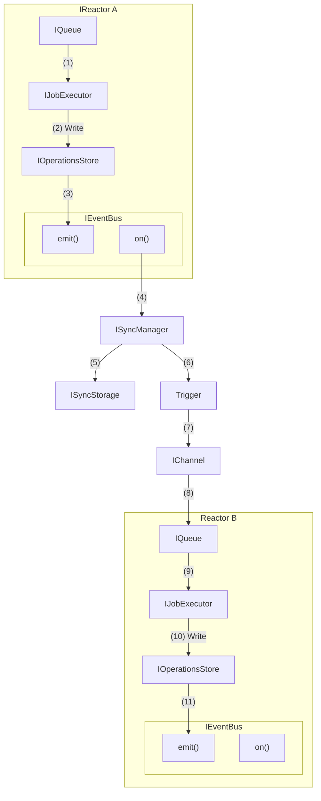
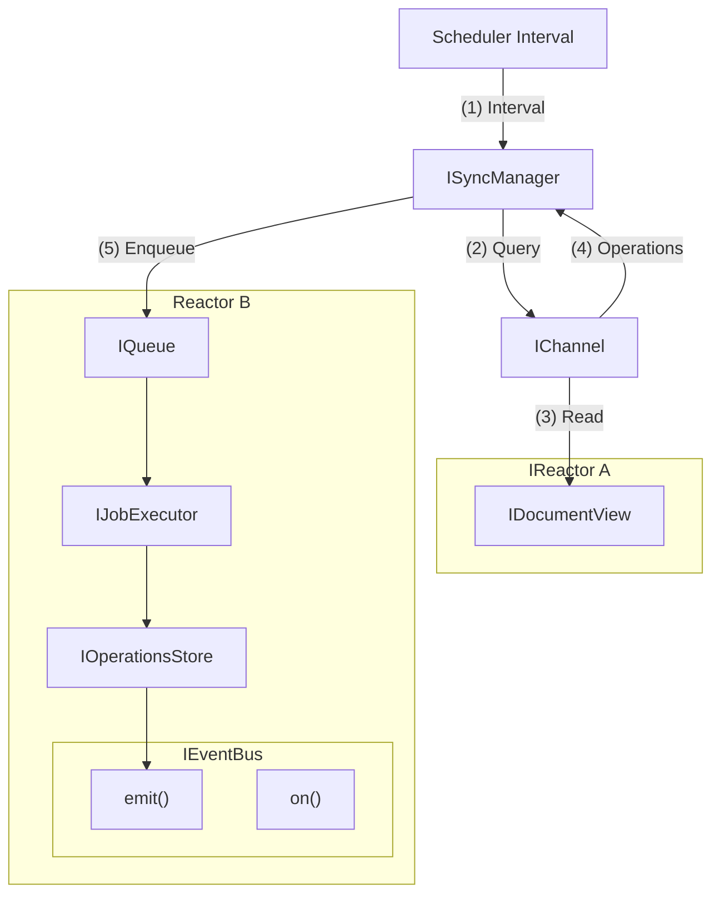
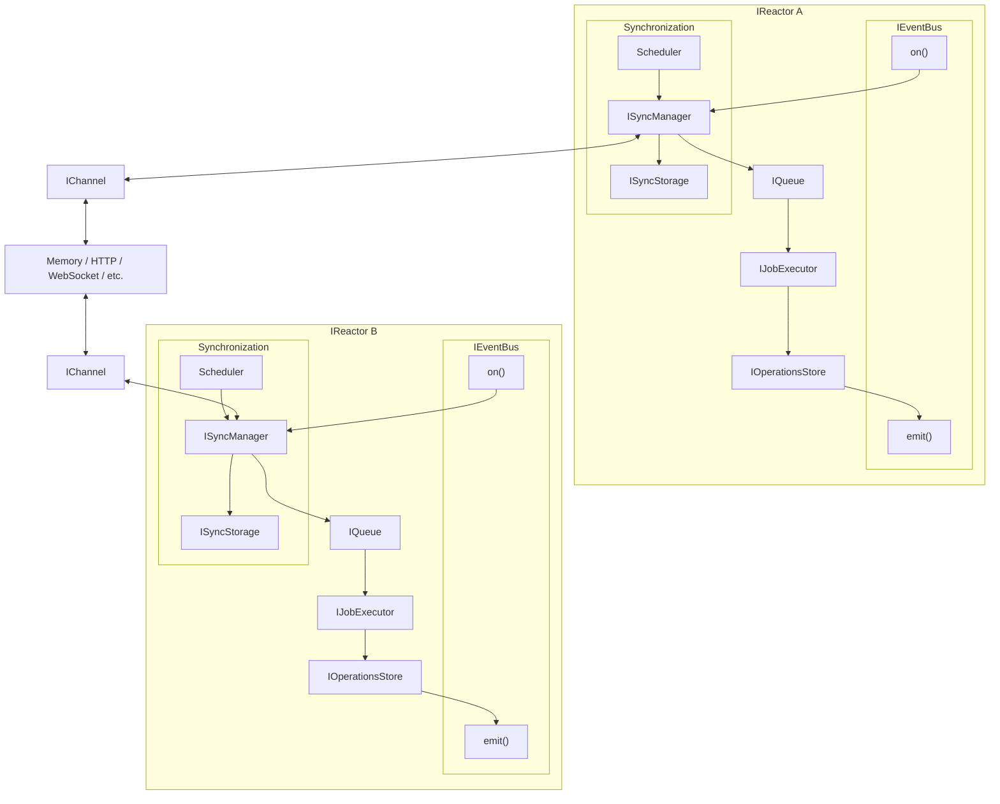
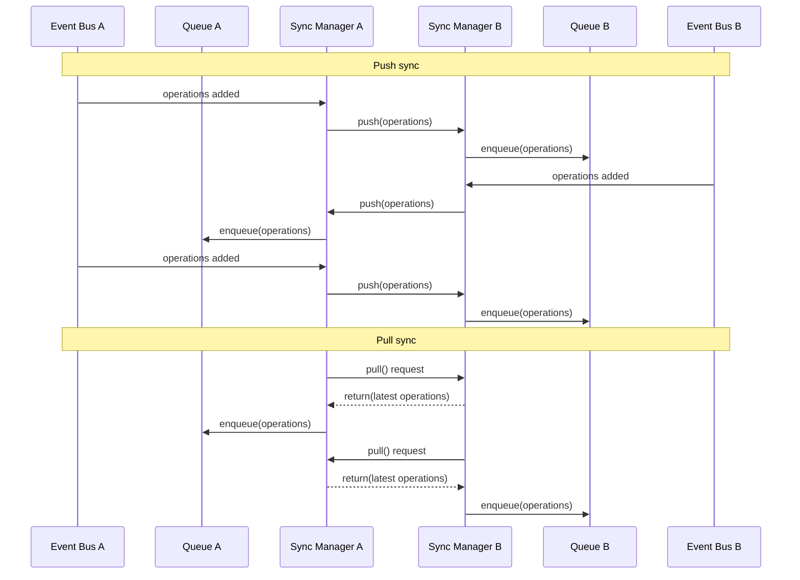

# Synchronization

Synchronization refers to synchronizing the operations of one reactor with another. This is a key part of the Reactor architecture.

- We focus on synchronizing the `IOperationsStore`,  and bubbling outward.
    - This allows us to decouple sync and Document View updates.
    - This consolidates `IListenerManager`, `ISyncManager`, and `IDocumentView` update flows into a single dispatch pattern.

### ISyncManager

This object manages the synchronization of operations between reactors.

- **`ISyncManager`**
    - In the following diagrams, this object is not an exact mapping to the current `ISyncManager`.
    - The `ISyncManager` has its own storage mechanism and rather than being tied so the internal mechanisms of the Reactor, propagates from the event bus.

#### Push

Describes a one-way flow of data from one Reactor to another, pushing operations through an `IChannel` interface.



#### Pull

Describes a one-way flow of data from one Reactor to another, pulling operations through an `IChannel` interface on an interval.



#### Ping-Pong

Since both `Push-to-Switchboard` and `Pull-from-Switchboard` are one-way flows, we combine them into a ping-pong pattern. This is where both reactors are pushing and pulling through the `IChannel` interface.

The schedulers are "smart" and understand how to optimimally set intervals based on a number of factors, including:

- Operation characteristics (size, frequency, etc.)
- Network characteristics (latency, bandwidth, etc.)
- Reactor characteristics (CPU, memory, etc.)
- Recent pushes from other reactor



#### Ping-Pong: Sequence



### IChannel

The `IChannel` interface is a bi-directional interface for sending, receiving, and tracking operations. We do this with `inbox` and `outbox` queues of `JobHandle` objects. Each handle tracks a job that is being applied by a server (local or remote, depending on the mailbox).

#### Interface

```tsx

enum JobStatus {
    /** The job status is not known */
    Unknown = -1,

    /** The job is being transported */
    TransportPending,

    /** The job is being executed */
    ExecutionPending,

    /** The job has been applied */
    Applied,

    /** The job has failed */
    Error,
}

class JobHandle {
    /** The unique id of the job */
    id: string;

    /** The document id that the job is operating on */
    documentId: string;

    /** The scopes affected */
    scopes: string[];

    /** The branch that the job is operating on */
    branch: string;

    /** The operations */
    operations: Operation[];

    /** The status of the job */
    status: JobStatus = JobStatus.Unknown;

    /** The error that occurred, if any */
    error?: Error;

    /**
     * Subscribes to changes in the job status.
     */
    on(callback: (job: JobHandle, prev: JobStatus, next: JobStatus) => void): void;
}

class PullJobHandle extends JobHandle {
    /**
     * Moves job from Unknown to TransportPending.
     */
    started(): void;

    /**
     * Moves job from TransportPending to ExecutionPending.
     */
    transported(): void;

    /**
     * Moves job from ExecutionPending to Applied.
     */
    executed(): void;

    /**
     * Moves job from any state to Error.
     */
    failed(error: Error): void;
}

class Mailbox<T> {
    /**
     * The items in the mailbox.
     */
    get items(): ReadonlyArray<T>;

    /**
     * Gets an item from the mailbox.
     */
    get(id: string): T | undefined;

    /**
     * Subscribes to new items being added to the mailbox.
     */
    added(callback: (item: T) => void): void;

    /**
     * Subscribes to items being removed from the mailbox.
     */
    removed(callback: (item: T) => void): void;

    /**
     * Pushes an item to the mailbox.
     */
    push(item: T): void;

    /**
     * Removes an item from the mailbox.
     */
    remove(item: T): void;
}

interface IChannel {
    /**
     * The incoming queue of operations that need to be applied to the local reactor.
     */
    inbox: Mailbox<PullJobHandle>;

    /**
     * The outgoing queue of operations being applied to the remote reactor.
     */
    outbox: Mailbox<JobHandle>;

    /**
     * Sends operations to the remote reactor.
     * 
     * @param operations - The operations to send
     */
    send(operations: Operation[]): void;
}

```

#### Usage

```tsx

const channel = new WebSocketChannel();

// when something is added to our inbox...
channel.inbox.added(handle => {
    // create a job from the handle
    const job = createJob(handle);

    // queue the job for execution
    await queue.enqueue(job);

    // watch for local job completion
    const result = await jobs.watch(job.id);

    // set status
    if (result.error) {
        handle.failed(result.error);
    } else {
        handle.executed();
    }
});

// when something is added to our outbox...
channel.outbox.added(job => {
    console.log(`Remote server is applying ${job.operations.length} operations...`);

    // eg - update progress indicator or status bar
});

// when something is removed from our outbox...
channel.outbox.removed(job => {
    console.log(`Remote server has applied ${job.operations.length} operations...`);
    
    // eg - update progress indicator or status bar
});

// listen for local job completion
events.on(JobExecutorEventTypes.JOB_COMPLETED, (job, result) => {
    // is this a job in our inbox?
    const handle = channel.inbox.get(job.id);
    if (handle) {
        handle.executed();

        // the channel will remove it from the inbox queue

        return;
    }

    // this isn't a job from another reactor, instead we need to send it to the remote server
    channel.send(job.operations);
});

```

#### Retries

The `IChannel` implementation is responsible for retrying failed push and pull operations due to network conditions. Implementations should use exponential backoff with jitter when applicable, according to a retry policy. Network errors should not be bubble up from the `IChannel` unless the retry policy is exhausted.

#### Optimization

The `IChannel` implementation is free to optimize in a number of ways. For instance, it may batch `push` operations and send them in the `pull` request. Over HTTP, for example, this would result in a single `pull` request that will decompose nicely when there is no socket available.

### Error Handling

All errors must be explicitly defined here with a clear description of the error, the conditions under which it occurs, and recovery strategies.

#### Push

The following errors may happen on push:

```tsx
/**
 * An un-recoverable network error has occurred.
 */
class ChannelNetworkError extends Error {
    // ...
}
```

#### Internal
