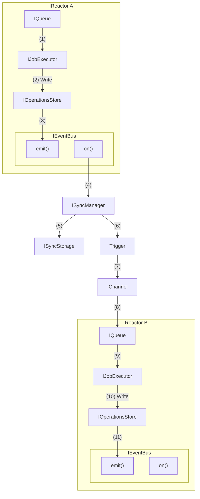
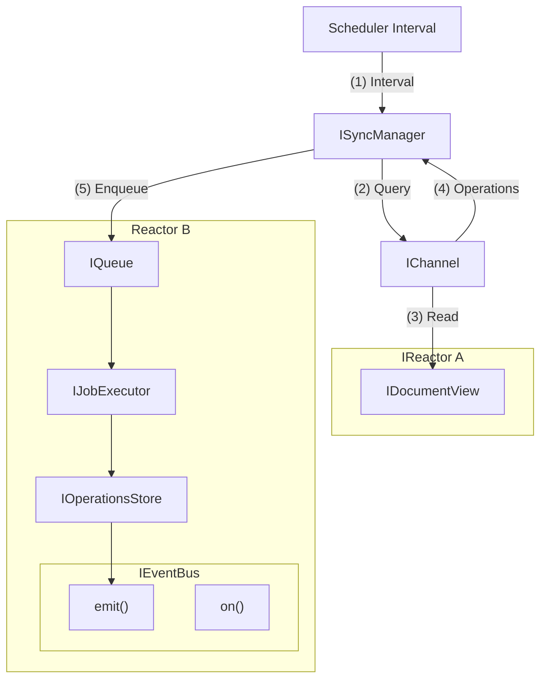
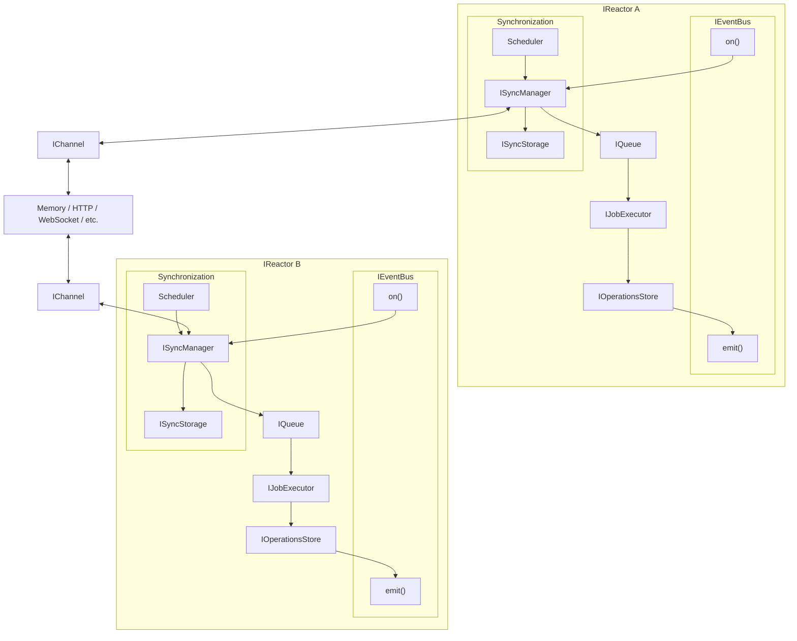
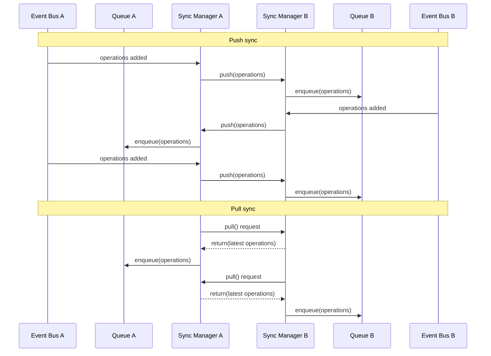

# Synchronization

Synchronization refers to synchronizing the operations of one reactor with another. This is a key part of the Reactor architecture.

- We focus on synchronizing the `IOperationsStore`, and bubbling outward.
  - This allows us to decouple sync and Document View updates.
  - This consolidates `IListenerManager`, `ISyncManager`, and `IDocumentView` update flows into a single dispatch pattern.

## ISyncManager

This object manages the synchronization of operations between reactors.

- **`ISyncManager`**
  - In the following diagrams, this object is not an exact mapping to the current `ISyncManager`.
  - The `ISyncManager` has its own storage mechanism and rather than being tied so the internal mechanisms of the Reactor, propagates from the event bus.

### Push

Describes a one-way flow of data from one Reactor to another, pushing operations through an `IChannel` interface.



### Pull

Describes a one-way flow of data from one Reactor to another, pulling operations through an `IChannel` interface on an interval.



### Ping-Pong

Since both `Push-to-Switchboard` and `Pull-from-Switchboard` are one-way flows, we combine them into a ping-pong pattern. This is where both reactors are pushing and pulling through the `IChannel` interface.

The schedulers are "smart" and understand how to optimimally set intervals based on a number of factors, including:

- Operation characteristics (size, frequency, etc.)
- Network characteristics (latency, bandwidth, etc.)
- Reactor characteristics (CPU, memory, etc.)
- Recent pushes from other reactor



### Ping-Pong: Sequence



## IChannel

The `IChannel` interface is a bi-directional interface for sending, receiving, and tracking operations. We do this with `inbox` and `outbox` queues of `JobHandle` objects. Each handle tracks a job that is being applied by a server (local or remote, depending on the mailbox).

### Interface

```tsx
enum JobChannelStatus {
  /** The job status is not known */
  Unknown = -1,

  /** The job is being transported */
  TransportPending,

  /** The job is being executed */
  ExecutionPending,

  /** The job has been applied */
  Applied,

  /** The job has failed */
  Error,
}

enum ChannelErrorSource {
  Channel = "channel",
  Inbox = "inbox",
  Outbox = "outbox",
}

class InternalChannelError extends Error {
  // ...
}

class ChannelError extends Error {
  /**
   * The source of the error.
   */
  source: ChannelErrorSource;

  /**
   * The error that occurred.
   */
  error: Error;

  constructor(source: ChannelErrorSource, error: Error) {
    super(message);

    this.source = source;
    this.error = error;
  }
}

class JobHandle {
  /** The unique id of the job */
  id: string;

  /** The document id that the job is operating on */
  documentId: string;

  /** The scopes affected */
  scopes: string[];

  /** The branch that the job is operating on */
  branch: string;

  /** The operations */
  operations: Operation[];

  /** The status of the job */
  status: JobChannelStatus = JobChannelStatus.Unknown;

  /** The error that occurred, if any */
  error?: ChannelError;

  /**
   * Subscribes to changes in the job status.
   */
  on(
    callback: (
      job: JobHandle,
      prev: JobChannelStatus,
      next: JobChannelStatus,
    ) => void,
  ): void;
}

class MutableJobHandle extends JobHandle {
  /**
   * Moves job from Unknown to TransportPending.
   */
  started(): void;

  /**
   * Moves job from TransportPending to ExecutionPending.
   */
  transported(): void;

  /**
   * Moves job from ExecutionPending to Applied.
   */
  executed(): void;

  /**
   * Moves job from any state to Error.
   */
  failed(error: Error): void;
}

class Mailbox<T> {
  /**
   * The items in the mailbox.
   */
  get items(): ReadonlyArray<T>;

  /**
   * Gets an item from the mailbox.
   */
  get(id: string): T | undefined;

  /**
   * Subscribes to new items being added to the mailbox.
   */
  onAdded(callback: (item: T) => void): void;

  /**
   * Subscribes to items being removed from the mailbox.
   */
  onRemoved(callback: (item: T) => void): void;
}

/**
 * This is the implementation used internally, but is not part of the public API.
 */
class MutableMailbox<T> extends Mailbox<T> {
  /**
   * Adds an item to the mailbox.
   */
  add(item: T): void;

  /**
   * Removes an item from the mailbox.
   */
  remove(item: T): void;
}

interface IChannel {
  /**
   * The incoming queue of operations that need to be applied to the local reactor.
   *
   * These are of type `PullJobHandle` to expose mutable functions to the consumer.
   */
  inbox: Mailbox<MutableJobHandle>;

  /**
   * The outgoing queue of operations being applied to the remote reactor.
   *
   * These are of type `JobHandle`, as the consumer does not mutate the job.
   */
  outbox: Mailbox<JobHandle>;

  /**
   * The dead letter queue of operations that have failed for any reason.
   *
   * These are of type `JobHandle`, as they can no longer be mutated.
   */
  deadLetter: Mailbox<JobHandle>;

  /**
   * Sends operations to the remote reactor.
   *
   * @param operations - The operations to send
   */
  send(operations: Operation[]): void;
}
```

### Usage

```tsx
const channel = new WebSocketChannel();

// when something is added to our inbox...
channel.inbox.added((handle) => {
  // create a job from the handle
  const job = createJob(handle);

  // queue the job for execution
  await queue.enqueue(job);

  // watch for local job completion
  const result = await jobs.watch(job.id);

  // set status
  if (result.error) {
    handle.failed(result.error);
  } else {
    handle.executed();
  }
});

// when something is added to our outbox...
channel.outbox.added((job) => {
  console.log(
    `Remote server is applying ${job.operations.length} operations...`,
  );

  // eg - update progress indicator or status bar
});

// when something is removed from our outbox...
channel.outbox.removed((job) => {
  console.log(
    `Remote server has applied ${job.operations.length} operations...`,
  );

  // eg - update progress indicator or status bar
});

// when a job has permanently failed to be applied...
channel.deadLetter.added((job) => {
  console.log(`Job ${job.id} has failed to be applied...`);
});

// listen for local job completion
events.on(JobExecutorEventTypes.JOB_COMPLETED, (job, result) => {
  // is this a job in our inbox?
  const handle = channel.inbox.get(job.id);
  if (handle) {
    handle.executed();

    // the channel will remove it from the inbox queue

    return;
  }

  // this isn't a job from another reactor, instead we need to send it to the remote server
  channel.send(job.operations);
});
```

### Retries

The `IChannel` implementation is responsible for retrying failed push and pull operations due to network conditions. Implementations should use exponential backoff with jitter when applicable, according to a retry policy.

Network errors should not bubble up from the `IChannel` unless the retry policy is exhausted.

### Optimization

The `IChannel` implementation is free to optimize in a number of ways. For instance, it may batch `push` operations and send them in the `pull` request. Over HTTP, for example, this would result in a single `pull` request that will decompose nicely when there is no socket available.

## Error Handling

The synchronization system must have a robust error handling strategy. All possible errors must be explicitly defined here with a clear description of the error, the conditions under which it occurs, and recovery strategies.

### `IChannel`

`IChannel` implementations communicate errors in one single way: the `error` object on `JobHandle` objects in the `deadLetter` mailbox. Every error that can occur in a channel is communicated to the consumer of the channel through this mailbox.

For example:

```tsx
const channel = new WebSocketChannel();

channel.deadLetter.added((job) => {
  // inspect error
  const error = job.error;
  const source = error.source;

  // handle ...
});
```

The `ChannelError` object has a `source` property that indicates the source of the error (could be inbox, outbox, or channel).

The `error` property can be one of two types:

- **JobError** - these are propagated job execution errors, documented in the [Jobs interface](../Jobs/interface.md).
- **InternalChannelError** - these are errors from the channel itself, not the job.

### Job Errors

#### `SIGNATURE_INVALID`

##### ChannelErrorSource.None

This is not a valid source for this error code, and should never happen. However, in the case that this does happen:

- The job will be logged as an error.
- The job will be removed from the inbox queue.

##### ChannelErrorSource.Inbox

This indicates that a remote operation could not be applied to the local reactor because of a signature mismatch. This should never happen _except in the case of a malicious actor_, as remote reactors are already validating signatures.

In the case that this does happen:

- The remote will be marked as invalid and no further operations will be sent to or received from it.
- The job will be removed from the inbox queue.

##### ChannelErrorSource.Outbox

This indicates that a local operation could not be applied to the remote reactor because of a signature mismatch. This means that while we were able to verify a signature, the remote was not. This is an unrecoverable error, signaling a problem with a remote reactor itself:

- The remote will be marked as invalid and no further operations will be sent to or received from it.
- The job will be removed from the outbox queue.

#### `HASH_MISMATCH`

##### ChannelErrorSource.None

This is not a valid source for this error code, and should never happen. However, in the case that this does happen:

- The job will be logged as an error.
- The job will be removed from the inbox queue.

##### ChannelErrorSource.Inbox

This indicates that a remote operation could not be applied to the local reactor because of an unrecoverable hash mismatch (note that retry/reshuffle has already been attempted). In this case:

- Create a branch at the last known good state.
- Re-apply the operation to the branch.
- Push the branch to the remote reactor.

##### ChannelErrorSource.Outbox

This indicates that a local operation could not be applied to the remote reactor because of a hash mismatch. This case should be handled by the receiving Reactor. In this case:

- The job will be discarded.

#### `LIBRARY_ERROR`

##### ChannelErrorSource.None

This is not a valid source for this error code, and should never happen. However, in the case that this does happen:

- The job will be discarded.

##### ChannelErrorSource.Inbox

This indicates that an error occurred in job execution locally, but not remotely. In this case:

- Create a branch at the last known good state.
- Re-apply the operation to the branch.
- Push the branch to the remote reactor.

##### ChannelErrorSource.Outbox

This indicates that an error occurred in job execution remotely, but not locally. The receiving Reactor should handle this case. In this case:

- The job will be discarded.

#### `MISSING_OPERATIONS`

##### ChannelErrorSource.None

This is not a valid source for this error code, and should never happen. However, in the case that this does happen:

- The job will be discarded.

##### ChannelErrorSource.Inbox

##### ChannelErrorSource.Outbox

#### `EXCESSIVE_SHUFFLE`

##### ChannelErrorSource.None

This is not a valid source for this error code, and should never happen. However, in the case that this does happen:

- The job will be discarded.

##### ChannelErrorSource.Inbox

This would mean that a local reactor is trying to submit an extremely out of date `Action`. In this case:

- Get latest operations from the remote reactor.
- Rebase locally.
- The action needs to be updated with the latest index and re-queued as a new job.

##### ChannelErrorSource.Outbox

This would mean that a remote reactor is trying to submit an extremely out of date `Action`. In this case:

- Notify the remote reactor that their operation has been rejected and they must locally rebase before resubmitting.

#### `GRACEFUL_ABORT`

For all sources, the `ISyncManager` will either write the mailboxes to disk (for processing later) or simply ignore and discard.

### Channel Errors

Channel errors will be documented here, depending on the implementation of the `IChannel` interface.

```tsx
class UnrecoverableRemoteError extends Error {
  /**
   * The name of the remote that is unrecoverable.
   */
  remote: string;

  /**
   * The error that occurred.
   */
  error: Error;
}
```
