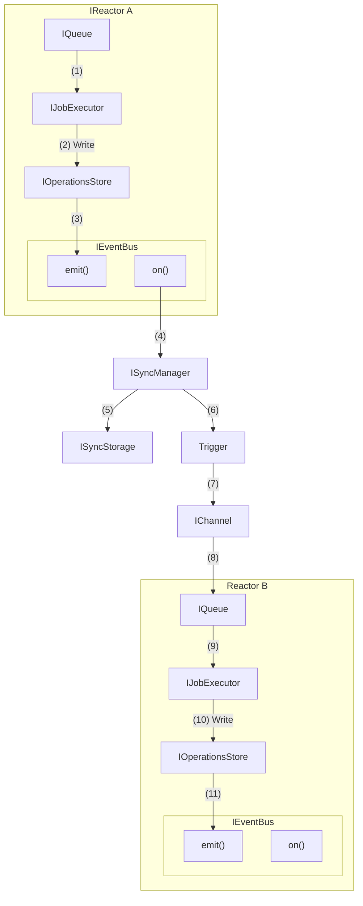
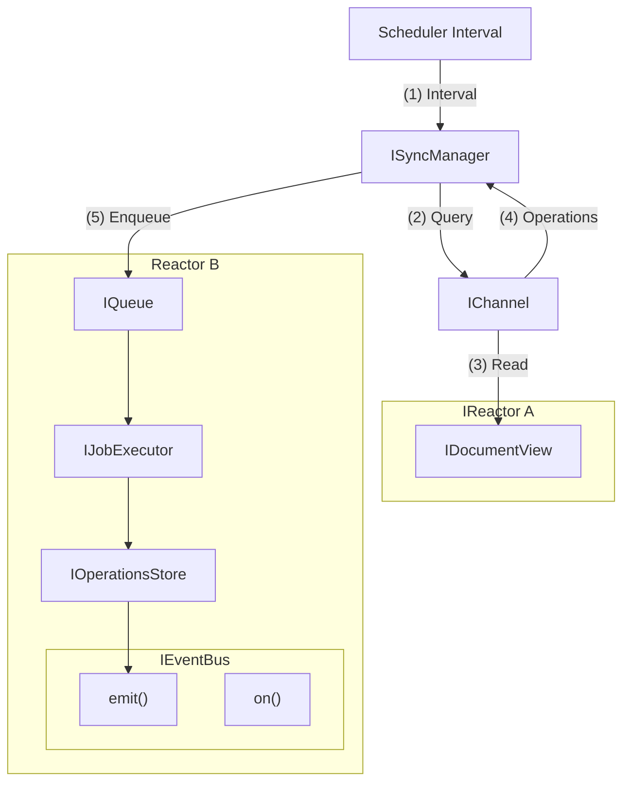

# Synchronization

Consider a synchronization scheme that relies on a unidirectional flow of data from Operations Store to Read Model. This diagram shows **flow**, not dependencies. Start at **(1)** and follow the numbered arrows to see each subsequent step.

Key points:

- We focus on synchronizing the IOperationsStore,  and bubbling outward.
    - This allows us to decouple sync and Document View updates.
    - This consolidates `ListenerManager`, `SyncManager`, and Document View update flows into a single dispatch pattern.
- **`SyncManager`**
    - In this diagram, this object is not an exact mapping to the current `SyncManager`.
    - The `SyncManager` has its own storage mechanism and rather than being tied so the internal mechanisms of the Reactor, propagates from the event bus.

### Push

Describes a one-way flow of data from one Reactor to another, pushing operations through an `IChannel` interface.



### Pull

Describes a one-way flow of data from one Reactor to another, pulling operations through an `IChannel` interface on an interval.



### Ping-Pong

Since both `Push-to-Switchboard` and `Pull-from-Switchboard` are one-way flows, we combine them into a ping-pong pattern. This is where both reactors are pushing and pulling through the `IChannel` interface.

```mermaid

```


