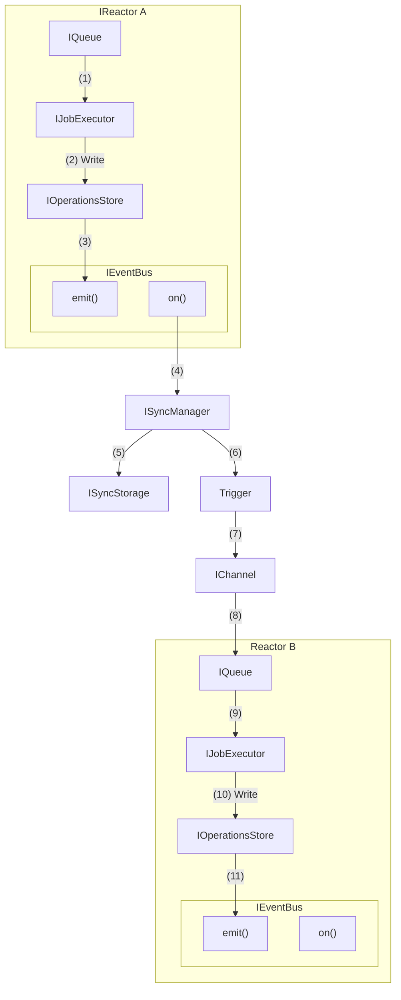
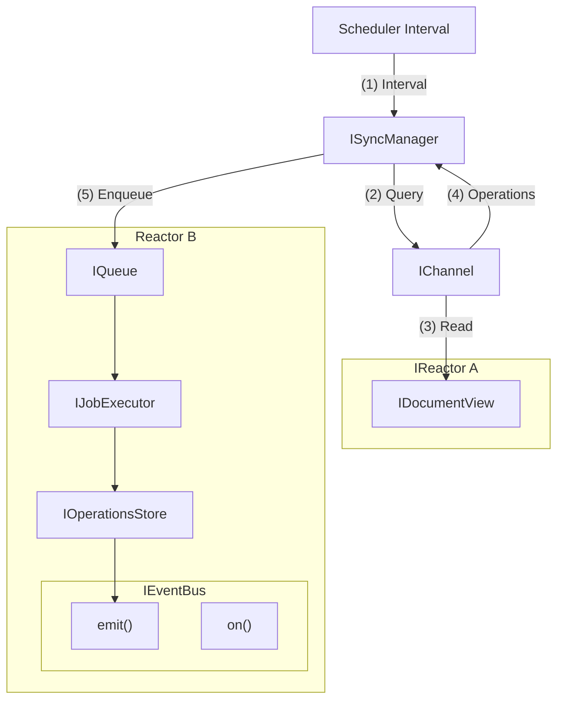
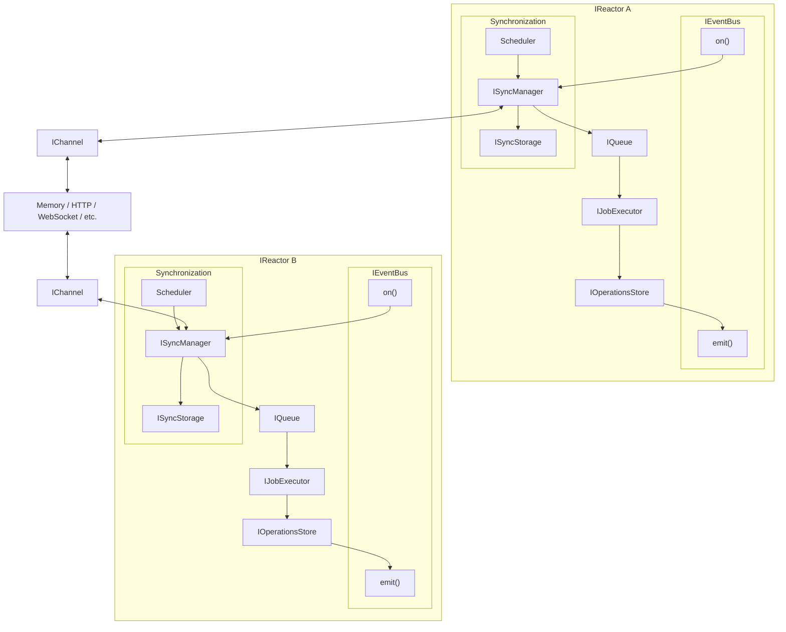
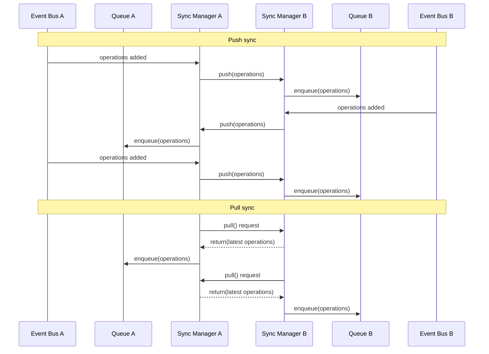

# Synchronization

Consider a synchronization scheme that relies on a unidirectional flow of data from Operations Store to Read Model. This diagram shows **flow**, not dependencies. Start at **(1)** and follow the numbered arrows to see each subsequent step.

Key points:

- We focus on synchronizing the IOperationsStore,  and bubbling outward.
    - This allows us to decouple sync and Document View updates.
    - This consolidates `ListenerManager`, `SyncManager`, and Document View update flows into a single dispatch pattern.
- **`SyncManager`**
    - In this diagram, this object is not an exact mapping to the current `SyncManager`.
    - The `SyncManager` has its own storage mechanism and rather than being tied so the internal mechanisms of the Reactor, propagates from the event bus.

### Push

Describes a one-way flow of data from one Reactor to another, pushing operations through an `IChannel` interface.



### Pull

Describes a one-way flow of data from one Reactor to another, pulling operations through an `IChannel` interface on an interval.



### Ping-Pong

Since both `Push-to-Switchboard` and `Pull-from-Switchboard` are one-way flows, we combine them into a ping-pong pattern. This is where both reactors are pushing and pulling through the `IChannel` interface.

The schedulers are "smart" and understand how to optimimally set intervals based on a number of factors, including:

- Operation characteristics (size, frequency, etc.)
- Network characteristics (latency, bandwidth, etc.)
- Reactor characteristics (CPU, memory, etc.)
- Recent pushes from other reactor



### Ping-Pong: Sequence



### IChannel

The `IChannel` interface is a bi-directional interface for sending and receiving operations.

```tsx

interface IChannel {
    /**
     * Push operations through to a remote reactor.
     */
    push(operations: Operation[]): void;

    /**
     * Pull operations from a remote reactor.
     */
    pull(): Promise<Operation[]>;
}

```

Note that the `IChannel` interface allows for easy composition, when we want to sync with multiple reactors. This is a naive example:

```tsx

class ChannelCollection<T extends IChannel> implements IChannel {
    constructor(private channels: T[]) {}

    push(operations: Operation[]): void {
        this.channels.forEach(channel => channel.push(operations));
    }

    pull(): Promise<Operation[]> {
        return this.channels.reduce((acc, channel) => acc.then(channel.pull()), Promise.resolve([]));
    }
}

```

### IChannel: Optimization

The `IChannel` implementation is free to batch `push` operations and send them in the `pull` request. Over HTTP, for example, this would result in a single `pull` request that will decompose nicely when there is no socket available.
