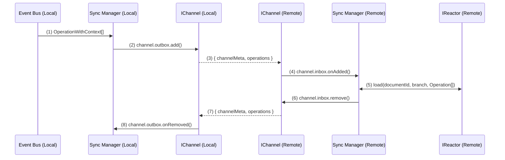
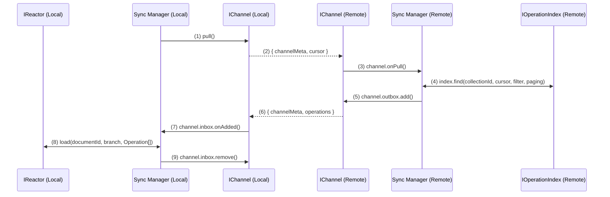
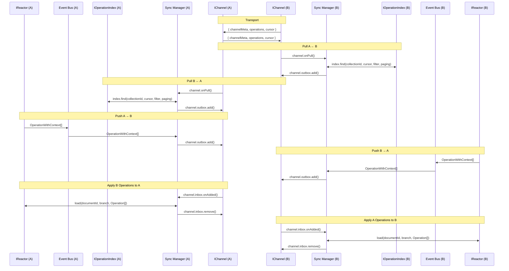

# Reactor Synchronization Specification

## Table of Contents

- [Layer 1: Overview & Conceptual Model](#layer-1-overview--conceptual-model)
- [Layer 2: Protocol Specification](#layer-2-protocol-specification)
- [Layer 3: Implementation Details](#layer-3-implementation-details)
- [Appendix: Legacy to New Concept Mapping](#appendix-legacy-to-new-concept-mapping)

---

# Layer 1: Overview & Conceptual Model

## Introduction

Reactor synchronization enables distributed operation-based collaboration between autonomous reactor instances. Operations (representing state mutations) flow bidirectionally through channels, maintaining eventual consistency while preserving causal ordering and supporting offline/online transitions.

This specification unifies two perspectives:

- **Conceptual granularity** (strand/thread/cable taxonomy) — helps reason about what we're synchronizing
- **Implementation optimization** (collection-based streams) — makes it efficient and scalable

## Core Concepts

Prerequisite reading:

- [Operations](../Operations/index.md)
- [IOperationStore](../Storage/IOperationStore.md)

### What Are We Synchronizing?

At the heart of synchronization is the **operation stream** — a totally-ordered stream of operations that, when reduced, produces a document's current state. Every operation stream is identified by a quadruple:

```
(remote, documentId, scope, branch)
```

**Key properties:**
- Operations within a stream are **append-only** with monotonically increasing indices
- Each operation carries a **state hash** for verification
- Operations may be **skipped or undone** through the skip parameter mechanism
- Streams are **causally ordered** — operations depend on all preceding operations in the same stream

### Synchronization Granularity: Strand, Thread, Cable

We define three levels of synchronization granularity that compose hierarchically:

#### 1. Synchronization Strand

The most granular level on which synchronization logic is defined is the **strand**. A strand synchronizes exactly one operation stream from source to destination:

```
(remote₁, documentId₁, scope₁, branch₁) → (remote₂, documentId₂, scope₂, branch₂)
```

**Properties:**
- All synchronization behavior (conflict detection, cursor tracking, ACK/NACK) is defined at strand granularity
- A strand maps to a single operation stream in the core `IOperationStorage` object

**Example:** Synchronizing the `main` branch of the `public` scope of document `doc-123` from Drive A to Drive B creates one strand.

#### 2. Synchronization Thread

A **document-level** synchronization channel. A thread synchronizes one or more strands for the same document pair:

```
(remote₁, documentId₁, ?, ?) → (remote₂, documentId₂, ?, ?)
```

**Thread types:**
- **Single-document thread:** `documentId₁ = documentId₂` (default, most common)
- **Cross-document thread:** `documentId₁ ≠ documentId₂` (for templates or copies)
- **Complete thread:** Synchronizes all scopes and branches of a document (leads to identical document instances)
- **Partial thread:** Synchronizes a subset of scopes/branches (e.g., only `public` scope or only `main` branch)

**Example:** Synchronizing both `public` and `protected` scopes of document `doc-123` from Drive A to Drive B creates a thread containing two strands (assuming one branch each).

#### 3. Synchronization Cable

A **drive-level** synchronization channel. A cable synchronizes multiple threads between two drive instances:

```
(remote₁, ?, ?, ?) → (remote₂, ?, ?, ?)
```

**Cable types:**
- **Complete cable:** Synchronizes all documents, scopes, and branches (leads to identical drive instances)
- **Partial cable:** Synchronizes a filtered subset (e.g., only public documents, only specific document types)

**Example:** Synchronizing all public documents from Drive A to Drive B creates a cable containing many threads (one per document).

### Collection-Based Optimization

While strand/thread/cable provide conceptual clarity, **collections** provide implementation efficiency.

The `IOperationStore` can be thought of as an an object that stores _strands_, i.e. it stores ordered operations for `(documentId, scope, branch)` tuples (see the [getSince()](../Storage/IOperationStore.md#interface) method). Therefore, it can easily be used to support synchronization of strands.

To support thread synchronization, we can use `getSince` to query across multiple scopes.

However, to support cable synchronization, we would need to make an arbitrary number of queries: one for the drive url, then at least one for each document contained in the drive. This is why we need to introduce the notion of **collections**.

A **collection** is a flattened stream of threads. This means that, given a set of threads `T = {(driveId, docId, scope, branch) | driveId = d}` for some constant `d`, a collection reduces `T` to a single ordered stream of operations by merging all operations from threads in `T`. We can then keep a single cursor for `T`, rather than a cursor for every element of `T`.

Practically, the job executor uses the [`IOperationIndex`](../Cache/operation-index.md) to forward-create collections as operations are executed. While, technically, arbitrary collections could be created, currently the job executor creates collections based on `document-drive` model creation:

```ts
const txn = index.start();

// elided

if (documentType === "powerhouse/document-drive") {
  collectionId = driveCollectionId(branch, documentId)
  txn.createCollection(collectionId);
}

// elided

await index.commit(txn);
```

> Future iterations of this system will introduce a new action, like CREATE_COLLECTION. This would explicitly tell the job executor to create a collection, rather than requiring core components to reference specific document models. This would also allow any other document model to have children.

The job executor then updates the collection based on relationship actions:

```ts
if (operation.action.type === "ADD_RELATIONSHIP") {
  index.addToCollection(
    driveCollectionId(branch, parentId),
    documentId,
  );
} else if (operation.action.type === "REMOVE_RELATIONSHIP") {
  index.removeFromCollection(
    driveCollectionId(branch, parentId),
    documentId,
    revision,
  );
}
```

**Key insight:** Instead of tracking cursors for thousands of individual strands `(remote, documentId, scope, branch)`, we track a single cursor per `(remote, collectionId)` pair.

**Example:** A cable synchronizing Drive A (100 documents) to Drive B requires only one cursor per branch rather than 100+ strand-level cursors.

## Synchronization Patterns

Now that we have an understanding of strands/threads/cables and collections, we can describe the high level synchronization sequence.

**Requisites:**
- There is one `IChannel` per `(remote, collectionId)` tuple.
- The `ISyncManager` is responsible for mapping operations to appropriate channels. It does this by reading meta information on `OperationWithContext`.
- Each `IChannel` is responsible for managing and storing its own cursor.
- Cursors can be updated using outgoing and incoming operations.

### Push Pattern

**Trigger:** Sender-initiated (event-driven)

**Example:** A user checks a box in a document model editor, which applies some action, like `SET_FLAG`.

**Flow:**


### Pull Pattern

**Trigger:** Receiver-initiated (scheduled, cursor-based)

**Example:** A reactor regularly polls the remote for new operations.
**Example:** A reactor starts up and pulls all operations from the remote to catch up.
**Example:** A reactor is offline for a period of time and needs to catch up.

**Flow:**


### Ping-Pong Pattern

**Trigger:** Bidirectional (both push and pull)

**Example:** Two reactors are pushing and pulling operations to keep in sync.

**Flow:**



# Layer 2: Protocol Specification

## Synchronization Primitives

### `OperationWithContext`

This is the primitive we are synchronizing. It is passed back and forth between reactors.

This object is defined in [src/storage/interfaces.ts](../../src/storage/interfaces.ts) and looks something like this:

```ts
export type OperationContext = {
  documentId: string;
  documentType: string;
  scope: string;
  branch: string;
  resultingState?: string; // populated only locally, in memory
};

export type OperationWithContext = {
  operation: Operation;
  context: OperationContext;
};
```

### `Remote`

```ts
type RemoteOptions = {
  // future configuration options
};

type RemoteFilter = {
  /**
   * Array of document ids. If specified, this further refines documents in a
   * collection.
   */
  documentId: string[];

  /** Array of operation scopes to include, use ["*"] for all */
  scope: string[];

  /** Branch to filter for. Use "main" for default behavior. */
  branch: string;
};

type Remote = {
  /** The name of the remote. Must be unique. Intended to be human
   * readable, but does not affect anything.
   */
  name: string;

  /** The id of the collection this remote is tracking */
  collectionId: string;

  /** Applies additional filtering on top of collections */
  filter: RemoteFilter;

  /** The channel connected to this remote */
  channel: IChannel;

  /** Options for the remote */
  options: RemoteOptions;
};
```

**Remote semantics:**
- Remotes are 1:1 with collections
- Remotes may have additional filtering logic on them through `RemoteFilter`

### `RemoteCursor`

A cursor tracks progress through a collection. This object is passed back and forth and also stored for catchup.

```typescript
type RemoteCursor = {
  remoteName: string;         // Which remote owns this cursor
  cursorOrdinal: number;      // Last processed ordinal (exclusive)
  lastSyncedAtUtcMs?: number; // Timestamp of last sync (which may have been push or pull)
};
```

**Cursor semantics:**
- Cursors are **exclusive** — the next query starts at `cursorOrdinal + 1`
- Cursors advance **atomically** with operation application (transactional)
- Cursors are **per-remote**

## Channel Model

### `IChannel`

Every `IChannel` has three mailboxes that hold `JobHandle` objects (which are defined below):

1. **Inbox:** Operations received from remote (awaiting local execution)
2. **Outbox:** Operations sent to remote (awaiting remote confirmation)
3. **DeadLetter:** Operations that failed permanently (retry exhausted, fatal error)

```ts
interface IChannel {
  /**
   * The incoming queue of operations that need to be applied to the local reactor.
   */
  inbox: Mailbox<JobHandle>;

  /**
   * The outgoing queue of operations being applied to the remote reactor.
   */
  outbox: Mailbox<JobHandle>;

  /**
   * The dead letter queue of operations that have failed for any reason.
   */
  deadLetter: Mailbox<JobHandle>;
}
```

### `Mailbox`

Each mailbox contains a set of objects, and dispatches when objects are added and removed.

```ts
class Mailbox<T> {
  /**
   * The items in the mailbox.
   */
  get items(): ReadonlyArray<T>;

  /**
   * Gets an item from the mailbox.
   */
  get(id: string): T | undefined;

  /**
   * Adds an item to the mailbox.
   */
  add(item: T): void;

  /**
   * Removes an item from the mailbox.
   */
  remove(item: T): void;

  /**
   * Subscribes to new items being added to the mailbox.
   */
  onAdded(callback: (item: T) => void): void;

  /**
   * Subscribes to items being removed from the mailbox.
   */
  onRemoved(callback: (item: T) => void): void;
}
```

### `JobHandle`

The `JobHandle` is the mutable data structure that tracks execution of a set of operations. They are named `JobHandle` because they follow the atomicity guarantees of `Job`s.

```ts
enum JobChannelStatus {
  /** The job status is not known */
  Unknown = -1,

  /** The job is being transported */
  TransportPending,

  /** The job is being executed */
  ExecutionPending,

  /** The job has been applied */
  Applied,

  /** The job has failed */
  Error,
}

enum ChannelErrorSource {
  None = "none",
  Channel = "channel",
  Inbox = "inbox",
  Outbox = "outbox",
}

class InternalChannelError extends Error {
  // ...
}

class ChannelError extends Error {
  /**
   * The source of the error.
   */
  source: ChannelErrorSource;

  /**
   * The error that occurred.
   */
  error: Error;

  constructor(source: ChannelErrorSource, error: Error) {
    super(`ChannelError[${source}]: ${error.message}`);

    this.source = source;
    this.error = error;
  }
}

class JobHandle {
  /** The unique id of the job */
  id: string;

  /** Remote name associated with this job (source for inbox, destination for outbox) */
  remoteName: string;

  /** The document id that the job is operating on */
  documentId: string;

  /** The scopes affected */
  scopes: string[];

  /** The branch that the job is operating on */
  branch: string;

  /** The operations */
  operations: Operation[];

  /** The status of the job */
  status: JobChannelStatus = JobChannelStatus.Unknown;

  /** The error that occurred, if any */
  error?: ChannelError;

  /**
   * Subscribes to changes in the job status.
   */
  on(
    callback: (
      job: JobHandle,
      prev: JobChannelStatus,
      next: JobChannelStatus,
    ) => void,
  ): void;

  /**
   * Moves job from Unknown to TransportPending.
   */
  started(): void;

  /**
   * Moves job from TransportPending to ExecutionPending.
   */
  transported(): void;

  /**
   * Moves job from ExecutionPending to Applied.
   */
  executed(): void;

  /**
   * Moves job from any state to Error.
   */
  failed(error: ChannelError): void;
}
```

A `JobHandle` represents a unit of work (one or more operations for a single document/branch):


**State transitions:**
- `Unknown` → `TransportPending`: Job entered channel, transport layer activated
- `TransportPending` → `ExecutionPending`: Job sent, queued for execution
- `ExecutionPending` → `Applied`: Job executed successfully, operations appended to history
- Any state → `Error`: Failure occurred (signature invalid, hash mismatch, library error, etc.)

### ACK/NACK Protocol

Channels use explicit acknowledgement to ensure both sides agree when operations are durably applied.

**Push ACK flow:**
1. Sender places `JobHandle` in its outbox (status = `Unknown`)
2. Sender calls `send()`, status → `TransportPending`
3. Receiver dequeues `MutableJobHandle` from its inbox (status = `ExecutionPending`)
4. Receiver executes operations locally
5. Receiver emits ACK message containing `jobId`
6. Sender receives ACK, removes handle from outbox, advances cursor
7. Sender updates remote health: `lastSuccessUtcMs`, `failureCount = 0`

**NACK flow:**
1-4. Same as ACK
5. Receiver execution fails, emits NACK with error details
6. Sender receives NACK, moves handle to `deadLetter` mailbox
7. Sender updates remote health: `lastFailureUtcMs`, increment `failureCount`
8. Sender applies retry policy or disables remote if threshold exceeded

**Idempotency:** Duplicate ACKs are safe — the `JobHandle` is removed only once. Missing ACKs trigger retries.

## Protocol Flows

### Push Flow Detail


**Key protocol steps:**

1. **Event Capture:** Sync manager subscribes to `JOB_COMPLETED` events
2. **Filter Matching:** Determine which remotes care about this operation (based on `RemoteFilter`)
3. **Job Creation:** Wrap operations in `JobHandle`, assign unique ID, set status = `Unknown`
4. **Enqueue:** Place in channel's outbox mailbox
5. **Transport:** Channel implementation sends via HTTP/WebSocket/in-memory
6. **Remote Receive:** Remote channel places in its inbox as `MutableJobHandle`
7. **Remote Execute:** Remote calls `load()`, operations processed by job executor
8. **Acknowledgement:** Remote sends ACK back to sender
9. **Cursor Advance:** Sender updates cursor, removes from outbox, updates health
10. **Cleanup:** Handle removed from mailbox (GC eligible)

### Pull Flow Detail


**Key protocol steps:**

1. **Schedule Trigger:** Scheduler fires based on interval (may be adaptive)
2. **Cursor Lookup:** Sync manager loads cursor from storage
3. **Index Query:** Query `IOperationIndex.find(collectionId, cursor, view, paging)` on remote
4. **Result Processing:** Remote index returns operations with new ordinal
5. **Job Creation:** Wrap operations in `MutableJobHandle[]`, status = `ExecutionPending`
6. **Enqueue:** Place in channel's inbox mailbox
7. **Local Execute:** For each handle, call `load()`, operations processed by job executor
8. **Cursor Advance:** After successful execution, update cursor in storage
9. **Health Update:** Update `lastPulledAtUtcMs`, `lastSuccessUtcMs`, reset `failureCount`
10. **Cleanup:** Handles removed from inbox (GC eligible)

### Bidirectional Ping-Pong Flow

Combines push and pull with smart scheduling:


**Scheduler intelligence:**
- **Backoff on recent push:** If A pushed to B recently, B's scheduler extends pull interval
- **Exponential backoff on failure:** If pull fails, increase interval exponentially
- **Adaptive interval:** Adjust based on operation volume and network characteristics

## Conflict Detection and Resolution

### Conflict Types

1. **Hash Mismatch:** Operation applied but resulting state hash differs
2. **Missing Operations:** Receiver missing operations between last known index and new operation
3. **Signature Invalid:** Operation signature verification fails
4. **Excessive Shuffle:** Operation index is far behind current head (rebase needed)

### Resolution Strategies

#### Hash Mismatch (Inbox)

**Scenario:** Remote sends operation with index 100, local applies it, but hash doesn't match.

**Strategy:**
1. Create a new branch at last known good state
2. Apply conflicting operation to the branch
3. Push branch back to remote
4. User resolves conflict via merge or branch selection

#### Missing Operations (Outbox)

**Scenario:** Remote responds "I need operations 95-99 before I can apply 100."

**Strategy:**
1. Sync manager queries `IOperationStore.getSince(documentId, branch, scope, 95)` as fallback
2. Resend missing operations batch
3. Retry original operation

#### Naive Rebase

For many document types, operations are **order-flexible** (e.g., adding two transactions to a portfolio can happen in either order).

**Strategy:**
1. When conflicts arise, put conflicting operations aside
2. Apply sender's operations first
3. Re-apply local conflicting operations with fresh indices
4. Rely on fault-tolerant reducers to handle reordering

**Trade-off:** Works well if operations have low coupling. Fails if operations have strict ordering dependencies (e.g., "edit transaction X" assumes X exists).

### Operation Skip/Undo Mechanism

The `skip` parameter allows undoing operations without mutating history:

**Example:**
```
Index 100: ADD_TRANSACTION(X)
Index 101: ADD_TRANSACTION(Y)
Index 102: UNDO(skip=1)  // Undoes operation 101
```

**Synchronization behavior:**
- Sender sends operation 102 with `skip=1`
- Receiver applies 102, marks 101 as `NOOP` or skips it during reduction
- Receiver's state matches sender's state

**History pruning:**
- Periodically, a `PRUNE(skip=200)` operation can compact history
- Receiver skips 200 operations, applies resulting state delta
- Reduces history size for long-lived documents

## Error Handling and Recovery

### Error Taxonomy

Errors are categorized by **source** and **type**:

```typescript
enum ChannelErrorSource {
  None = "none",         // Error origin unknown
  Channel = "channel",   // Transport/network error
  Inbox = "inbox",       // Error applying received operations
  Outbox = "outbox"      // Error sending operations
}

type JobErrorType =
  | "SIGNATURE_INVALID"
  | "HASH_MISMATCH"
  | "LIBRARY_ERROR"
  | "MISSING_OPERATIONS"
  | "EXCESSIVE_SHUFFLE"
  | "GRACEFUL_ABORT";
```

### Error Handling Matrix

| Error Type | Source: Inbox | Source: Outbox | Source: Channel |
|---|---|---|---|
| **SIGNATURE_INVALID** | Mark remote invalid, disable remote | Mark remote invalid, disable remote | N/A |
| **HASH_MISMATCH** | Create branch, reapply operation, push to remote | Discard job (remote handles) | N/A |
| **LIBRARY_ERROR** | Create branch, reapply operation, push to remote | Discard job (remote handles) | N/A |
| **MISSING_OPERATIONS** | Discard job | Pull missing operations, resend | N/A |
| **EXCESSIVE_SHUFFLE** | Pull latest, rebase, re-queue as new job | Notify remote to rebase | N/A |
| **GRACEFUL_ABORT** | Discard, catch up next cycle | Discard, catch up next cycle | Discard, catch up next cycle |
| **Transport Failure** | N/A | N/A | Retry with backoff, then disable |

### Retry Policy

**Exponential backoff with jitter:**
```
retryDelayMs = min(maxDelay, baseDelay * 2^failureCount + jitter)
```

**Default values:**
- `baseDelay` = 1000ms
- `maxDelay` = 300000ms (5 minutes)
- `maxRetries` = 5

**Failure threshold:**
- After 5 consecutive failures, remote is marked as `error` state
- User intervention required to re-enable (or automatic re-enable after health check)

### Health Tracking

```typescript
type ChannelHealth = {
  state: "idle" | "running" | "error";
  lastSuccessUtcMs?: number;
  lastFailureUtcMs?: number;
  failureCount: number;
};

type RemoteStatus = {
  push: ChannelHealth;
  pull: ChannelHealth;
};
```

**State transitions:**
- `idle` → `running`: Sync operation started
- `running` → `idle`: Sync operation succeeded
- `running` → `error`: Sync operation failed after retries exhausted
- `error` → `idle`: User re-enabled remote or health check passed

---

# Layer 3: Implementation Details

## Core Interfaces

### ISyncManager

The orchestrator for all synchronization activity:

```typescript
interface ISyncManager {
  get(name: string): Promise<Remote | null>;
  add(
    name: string,
    channel: IChannel,
    filter?: RemoteFilter,
    options?: RemoteOptions
  ): Promise<Remote>;
  remove(name: string): Promise<void>;
  list(): Remote[];
  setFilter(name: string, filter: RemoteFilter): Promise<void>;
}

type Remote = {
  name: string;
  channel: IChannel;
  filter: RemoteFilter;
  options: RemoteOptions;
};
```

**Responsibilities:**
- Register/unregister remotes
- Subscribe to event bus for push events
- Schedule pull intervals
- Match operations against remote filters
- Coordinate with `IOperationIndex` for cursor-based queries
- Manage remote health and error handling

### IChannel

The transport abstraction:

```typescript
interface IChannel {
  inbox: Mailbox<MutableJobHandle>;
  outbox: Mailbox<JobHandle>;
  deadLetter: Mailbox<JobHandle>;
  send(docId: string, branch: string, operations: Operation[]): void;
}

class Mailbox<T> {
  get items(): ReadonlyArray<T>;
  get(id: string): T | undefined;
  onAdded(callback: (item: T) => void): void;
  onRemoved(callback: (item: T) => void): void;
}
```

**Responsibilities:**
- Transport operations between reactors (HTTP/WebSocket/in-memory)
- Manage inbox/outbox/deadLetter mailboxes
- Implement retry policy with exponential backoff
- Emit ACK/NACK messages
- Track per-job status transitions

### JobHandle

Represents a unit of synchronization work:

```typescript
class JobHandle {
  id: string;
  remoteName: string;
  documentId: string;
  scopes: string[];
  branch: string;
  operations: Operation[];
  status: JobChannelStatus;
  error?: ChannelError;

  on(
    callback: (
      job: JobHandle,
      prev: JobChannelStatus,
      next: JobChannelStatus
    ) => void
  ): void;
}

class MutableJobHandle extends JobHandle {
  started(): void;
  transported(): void;
  executed(): void;
  failed(error: ChannelError): void;
}

enum JobChannelStatus {
  Unknown = -1,
  TransportPending,
  ExecutionPending,
  Applied,
  Error
}
```

**Usage:**
- Channel creates `JobHandle` for outbox (immutable reference for monitoring)
- Channel creates `MutableJobHandle` for inbox (mutable for status updates)
- Consumer calls lifecycle methods (`started()`, `transported()`, `executed()`, `failed()`)
- Channel moves to `deadLetter` on terminal failure

### ISyncStorage

Durable storage for synchronization metadata:

```typescript
interface ISyncStorage {
  listRemotes(signal?: AbortSignal): Promise<RemoteRecord[]>;
  getRemote(name: string, signal?: AbortSignal): Promise<RemoteRecord | null>;
  upsertRemote(remote: RemoteRecord, signal?: AbortSignal): Promise<void>;
  removeRemote(name: string, signal?: AbortSignal): Promise<void>;

  listCursors(remoteName: string, signal?: AbortSignal): Promise<RemoteCursor[]>;
  getCursor(
    remoteName: string,
    collectionId: string,
    signal?: AbortSignal
  ): Promise<RemoteCursor | null>;
  upsertCursor(cursor: RemoteCursor, signal?: AbortSignal): Promise<void>;
  removeCursor(
    remoteName: string,
    collectionId: string,
    signal?: AbortSignal
  ): Promise<void>;
}

type RemoteRecord = {
  name: string;
  channelType: string;
  channelConfig: JsonObject;
  filter: RemoteFilter;
  options?: RemoteOptions;
  status: RemoteStatus;
  lastError?: string;
  createdAtUtcMs: number;
  updatedAtUtcMs: number;
};

type RemoteCursor = {
  remoteName: string;
  collectionId: string;
  cursorOrdinal: number;
  view: ViewFilter;
  lastPulledAtUtcMs?: number;
};
```

## Integration with IOperationIndex

The `IOperationIndex` serves as the **write model** for synchronization. It participates in the same transaction as the `IOperationStore`, ensuring:

1. **Synchronous writes:** Operations written to index at same time as store
2. **Rollback:** If store write fails, index write is rolled back
3. **Ordering guarantees:** Index ordinals match operation commit order
4. **No lag:** Pull latency bounded only by network time

### Collection Semantics

Collections flatten document relationships:

```typescript
function driveCollectionId(branch: string, driveId: string): CollectionId {
  return `collection.${branch}.${driveId}`;
}
```

**Collection membership:**
- A document is in a drive's collection if it has ever been attached to that drive
- Detaching a document does NOT remove it from the collection (append-only)
- Collections are per-branch (e.g., `collection.main.drive-A`, `collection.draft.drive-A`)

**Querying collections:**
```typescript
const results = await operationIndex.find(
  collectionId,   // e.g., "collection.main.drive-123"
  cursor,         // Ordinal to start from (exclusive)
  viewFilter,     // Additional document/scope filters
  paging          // Limit/offset for batching
);
```

### Filter Projection

The sync manager decomposes a `RemoteFilter` into collection queries:

**Example:**
```typescript
RemoteFilter:
  documentType: ["maker/*"]
  documentId: ["drive-123"]
  scope: ["public", "protected"]
  branch: ["main"]

Decomposed queries:
  collectionId: "collection.main.drive-123"
  viewFilter: {
    documentType: ["maker/*"],
    scope: ["public", "protected"]
  }
```

**Constraint:** If a filter cannot be decomposed (e.g., watching a single non-drive document), the manager throws an error during `add()` or `setFilter()`.

### Write Model vs Read Model

The `IOperationIndex` is a **write model** because:
- It is written synchronously with job execution (same transaction)
- It rolls back if the operation store write fails
- Consumers see operations immediately (no lag)

This contrasts with traditional read models that:
- Are written asynchronously (event bus propagation)
- May lag behind the write model
- Require eventual consistency guarantees

**Trade-off:** Synchronous index writes add latency to job execution, but eliminate pull lag.

## Storage Schema

### sync_remotes

Stores remote registry:

```sql
CREATE TABLE sync_remotes (
  name TEXT PRIMARY KEY,
  channel_type TEXT NOT NULL,
  channel_config JSONB NOT NULL,
  filter JSONB NOT NULL,
  options JSONB,
  status JSONB NOT NULL,
  last_error TEXT,
  created_at TIMESTAMPTZ NOT NULL DEFAULT now(),
  updated_at TIMESTAMPTZ NOT NULL DEFAULT now()
);
```

### sync_remote_collections

Stores per-remote, per-collection cursors:

```sql
CREATE TABLE sync_remote_collections (
  remote_name TEXT NOT NULL REFERENCES sync_remotes(name) ON DELETE CASCADE,
  collection_id TEXT NOT NULL,
  cursor_ordinal BIGINT NOT NULL DEFAULT 0,
  view JSONB NOT NULL,
  last_pulled_at TIMESTAMPTZ,
  PRIMARY KEY (remote_name, collection_id)
);

CREATE INDEX idx_sync_remote_collections_cursor
  ON sync_remote_collections(remote_name, cursor_ordinal DESC);
```

### sync_remote_health

Stores push/pull health metrics:

```sql
CREATE TABLE sync_remote_health (
  remote_name TEXT NOT NULL REFERENCES sync_remotes(name) ON DELETE CASCADE,
  channel_kind TEXT NOT NULL,  -- "push" | "pull"
  state TEXT NOT NULL,
  last_success TIMESTAMPTZ,
  last_failure TIMESTAMPTZ,
  failure_count INTEGER NOT NULL DEFAULT 0,
  PRIMARY KEY (remote_name, channel_kind)
);
```

## Channel Implementations

### InternalChannel

**Use case:** In-memory synchronization within a single process (e.g., read-model updates)

**Transport:** Direct function call (no network)

**ACK behavior:** Synchronous (ACK immediately after execution)

**Example:**
```typescript
const channel = new InternalChannel();
channel.inbox.onAdded(async (handle) => {
  const job = createJob(handle);
  await queue.enqueue(job);
  const result = await jobs.watch(job.id);
  if (result.error) {
    handle.failed(new ChannelError(ChannelErrorSource.Inbox, result.error));
  } else {
    handle.executed();
  }
});
```

### HTTPChannel

**Use case:** Remote synchronization over HTTP (RESTful API)

**Transport:** HTTP POST with JSON payload

**ACK behavior:** Asynchronous (ACK via response status code or separate endpoint)

**Push request:**
```http
POST /sync/push
Content-Type: application/json

{
  "jobId": "job-123",
  "remoteName": "backup-us-west",
  "documentId": "doc-456",
  "branch": "main",
  "operations": [...]
}
```

**Push response (ACK):**
```http
HTTP/1.1 200 OK
Content-Type: application/json

{
  "jobId": "job-123",
  "status": "applied"
}
```

**Pull request:**
```http
GET /sync/pull?collectionId=collection.main.drive-123&cursor=1234&limit=100
```

**Pull response:**
```http
HTTP/1.1 200 OK
Content-Type: application/json

{
  "operations": [...],
  "nextCursor": 1334
}
```

### WebSocketChannel

**Use case:** Real-time bidirectional synchronization

**Transport:** WebSocket with JSON messages

**ACK behavior:** Asynchronous (ACK via separate message)

**Message types:**
```typescript
type WSMessage =
  | { type: "push", jobId: string, documentId: string, branch: string, operations: Operation[] }
  | { type: "ack", jobId: string }
  | { type: "nack", jobId: string, error: ChannelError }
  | { type: "pull", collectionId: string, cursor: number, filter: ViewFilter }
  | { type: "pull_response", operations: Operation[], nextCursor: number };
```

### RESTWebhookChannel

**Use case:** Push-only webhook delivery to external services

**Transport:** HTTP POST with configurable payload

**ACK behavior:** HTTP status code determines success/failure

**Configuration:**
```typescript
const channel = new RESTWebhookChannel({
  url: "https://api.example.com/webhook",
  headers: { "Authorization": "Bearer token123" },
  payloadTemplate: "stateOnly" | "operations" | "full"
});
```

**Payload templates:**
- `stateOnly`: Only send final document state
- `operations`: Send operations array
- `full`: Send operations + state + metadata

## Scheduler Implementation

### Adaptive Interval Calculation

```typescript
class AdaptiveScheduler {
  private baseIntervalMs: number = 30000; // 30 seconds
  private lastPushTimestampMs: number = 0;
  private lastPullTimestampMs: number = 0;

  calculateNextInterval(remote: Remote): number {
    const now = Date.now();
    const timeSinceLastPush = now - this.lastPushTimestampMs;

    // If recent push, extend pull interval
    if (timeSinceLastPush < 60000) { // 1 minute
      return this.baseIntervalMs * 2;
    }

    // If no recent push, use base interval
    return this.baseIntervalMs;
  }

  notifyPush() {
    this.lastPushTimestampMs = Date.now();
  }
}
```

### Backoff on Failure

```typescript
function calculateBackoff(failureCount: number): number {
  const baseDelay = 1000;
  const maxDelay = 300000; // 5 minutes
  const jitter = Math.random() * 1000;
  return Math.min(maxDelay, baseDelay * Math.pow(2, failureCount) + jitter);
}
```

## Consistency and Transactions

### Cursor Advancement

Cursors MUST advance atomically with operation application:

```typescript
async function applyOperations(
  documentId: string,
  branch: string,
  operations: Operation[],
  remoteName: string,
  collectionId: string,
  newCursor: number
): Promise<void> {
  await db.transaction(async (tx) => {
    // 1. Apply operations to document
    await operationStore.append(documentId, branch, operations, { tx });

    // 2. Update operation index (synchronous write model)
    await operationIndex.insert(operations, { tx });

    // 3. Advance cursor
    await syncStorage.upsertCursor(
      { remoteName, collectionId, cursorOrdinal: newCursor },
      { tx }
    );

    // If any step fails, entire transaction rolls back
  });
}
```

**Guarantees:**
- If operations fail to apply, cursor does not advance
- If cursor fails to update, operations are rolled back
- Receiver never "loses" operations or double-applies them

### Write Model Synchronization

The `IOperationIndex` is written in the **same transaction** as the `IOperationStore`:

```typescript
async function executeJob(job: Job): Promise<void> {
  const operations = reduceActionsToOperations(job.actions);

  await db.transaction(async (tx) => {
    // Write to authoritative store
    await operationStore.append(job.documentId, job.branch, operations, { tx });

    // Write to index (same transaction, same commit)
    await operationIndex.insert(operations, { tx });

    // If either fails, both roll back
  });

  // Only after commit do we emit events
  eventBus.emit(JobExecutorEventTypes.JOB_COMPLETED, { job, operations });
}
```

**Trade-off:** Synchronous index writes add ~10-50ms latency to job execution, but eliminate pull lag and simplify reconciliation.

## Error Recovery Workflows

### Scenario 1: Hash Mismatch on Inbox

**Problem:** Remote sent operation 100, local applied it, but hash doesn't match.

**Recovery:**
1. Detect hash mismatch during `load()` execution
2. Create new branch: `conflict-{remoteName}-{timestamp}`
3. Apply operation to conflict branch
4. Push conflict branch to remote via outbox
5. Emit user notification: "Conflict detected, resolve at branch `conflict-...`"

```typescript
try {
  await applyOperation(operation);
} catch (error) {
  if (error.code === "HASH_MISMATCH") {
    const conflictBranch = `conflict-${remoteName}-${Date.now()}`;
    await createBranch(documentId, conflictBranch, lastGoodState);
    await applyOperation(operation, { branch: conflictBranch });
    await channel.send(documentId, conflictBranch, [operation]);
    await notifyUser(`Conflict detected: ${conflictBranch}`);
  }
}
```

### Scenario 2: Missing Operations on Outbox

**Problem:** Remote responds "I need operations 95-99 before I can apply 100."

**Recovery:**
1. Receive NACK with error `MISSING_OPERATIONS`, details: `{ needed: [95, 99] }`
2. Query `IOperationStore.getRange(documentId, branch, scope, 95, 99)`
3. Create new `JobHandle` for missing operations
4. Send missing batch via channel
5. Retry original operation

```typescript
channel.deadLetter.onAdded(async (job) => {
  if (job.error?.error.code === "MISSING_OPERATIONS") {
    const { needed } = job.error.error.details;
    const missingOps = await operationStore.getRange(
      job.documentId,
      job.branch,
      job.scopes,
      needed[0],
      needed[needed.length - 1]
    );

    await channel.send(job.documentId, job.branch, missingOps);
    await channel.send(job.documentId, job.branch, job.operations); // Retry
  }
});
```

### Scenario 3: Remote Offline (Transport Failure)

**Problem:** Channel cannot connect to remote (network down, server unreachable).

**Recovery:**
1. Channel detects transport failure (connection refused, timeout, etc.)
2. Create `ChannelError(ChannelErrorSource.Channel, error)`
3. Apply retry policy with exponential backoff
4. After 5 retries, move remote to `error` state
5. User notified: "Remote `backup-us-west` is offline"
6. Operations queued in outbox, wait for remote recovery or user intervention

```typescript
async function transportWithRetry(message: any, maxRetries: number): Promise<void> {
  let retries = 0;
  while (retries < maxRetries) {
    try {
      await transport.send(message);
      return; // Success
    } catch (error) {
      retries++;
      const backoffMs = calculateBackoff(retries);
      await sleep(backoffMs);
    }
  }

  // Retries exhausted
  throw new ChannelError(
    ChannelErrorSource.Channel,
    new Error("Transport failure after retries")
  );
}
```

---

# Appendix: Legacy to New Concept Mapping

This section explicitly maps concepts from the legacy specification to the new implementation.

## Terminology Mapping

| Legacy Term | New Term | Notes |
|---|---|---|
| **Synchronization Strand** | `(remote, collectionId, viewFilter)` tuple | Strand is the conceptual unit; implementation uses collection + filter |
| **Synchronization Thread** | Set of strands for one document | No explicit type; composed of multiple `RemoteCursor` entries |
| **Synchronization Cable** | `Remote` with drive-level filter | A `Remote` can represent a cable if filter includes all documents |
| **Sender** | The reactor pushing operations | Role determined by flow direction |
| **Receiver** | The reactor pulling/accepting operations | Role determined by flow direction |
| **Push Update** | Push pattern | Sender initiates via event bus subscription |
| **Pull Update** | Pull pattern | Receiver initiates via scheduler |
| **Process/Send** | Pre-processed push (e.g., webhook) | Channel implements payload transformation |
| **Send/Process** | Raw push (e.g., reactor-to-reactor) | Operations sent unmodified, receiver validates |
| **Listener** | `Remote` | A remote is a registered synchronization endpoint |
| **ListenerFilter** | `RemoteFilter` | Coarse-grained filter (documentType, documentId, scope, branch) |
| **Synchronization Unit** | `(documentId, scope, branch)` | Identifies one operation history |
| **sync_id** | `(remoteName, collectionId)` | Identifying tuple for cursor storage |
| **listener_rev** | `cursorOrdinal` | Tracks progress through collection |
| **Listener State Cache** | `sync_remote_collections` table | Persisted cursor state per remote per collection |
| **Transmitter** | `IChannel` implementation | Transport abstraction (HTTP, WebSocket, etc.) |
| **StrandUpdate** | `JobHandle` | Represents operations in transit |

## Protocol Step Mapping

### Legacy 9-Step Protocol → New JobHandle Lifecycle

| Legacy Step | New Implementation | Notes |
|---|---|---|
| **1. SETUP** | `ISyncManager.add(remote)` + cursor initialization | Remote registered, cursors seeded at ordinal 0 |
| **2. REQUEST** | Scheduler triggers pull, `IOperationIndex.find()` | Receiver queries index with cursor |
| **3. TRIGGER/UPDATE/SELECT** | Event bus subscription, filter matching | Sender matches operations against remote filters |
| **4. PREDICT** | Filter + paging logic in `find()` | Optimal batch size determined by index query |
| **5. PRE-PROCESS** | Channel-specific payload transformation | E.g., webhook channel sends only state |
| **6. TRANSMIT** | `IChannel.send()` + transport layer | HTTP POST, WebSocket message, etc. |
| **7. POST-PROCESS** | `load()` + job execution | Receiver validates signatures, applies operations |
| **8. RETURN** | ACK/NACK message back through channel | Receiver sends success/failure status |
| **9. ADJUST** | Cursor advance + health update | Sender updates `sync_remote_collections` and `sync_remote_health` |

## Data Model Mapping

### Legacy Synchronization Units Table

```
| sync_id | drive_id | doc_id | doc_type | scope | branch | last_updated | revision |
```

**New equivalent:**
- No direct equivalent table (denormalized)
- `IOperationStore` holds operation histories
- `IOperationIndex` provides fast collection queries
- `sync_remote_collections` tracks cursor per `(remote, collection)` instead of per `(remote, doc, scope, branch)`

**Key optimization:** Collection-based storage reduces row count by 10-100x.

### Legacy Listener State Cache

```
| listener_id | sync_id | sync_rev | block | listener_rev | listener_status | pending_timeout |
```

**New equivalent:**
```sql
sync_remote_collections (
  remote_name,
  collection_id,
  cursor_ordinal,  -- equivalent to listener_rev
  view,
  last_pulled_at
)

sync_remote_health (
  remote_name,
  channel_kind,  -- push | pull
  state,         -- idle | running | error (equivalent to listener_status)
  last_success,
  last_failure,
  failure_count
)
```

**Key differences:**
- `pending_timeout` replaced by job-level status tracking in `JobHandle`
- `block` (blocking listener) removed; all listeners async (handled via job queue priority)
- Health tracking split into push/pull for bidirectional remotes

## Operation Skip/Undo

### Legacy Approach

```
| sync_id | revision_idx | committed | operation | params | state_hash | skip |
| 53      | 69           | ...       | ADD_TX    | {...}  | bb0f0563   | 2    |
```

Operation 69 with `skip=2` means: "Undo operations 67 and 68 before applying 69."

### New Approach

Same mechanism exists at the `IOperationStore` level:

```typescript
type Operation = {
  index: number;
  skip: number;  // Number of prior operations to undo
  // ...
};
```

**Synchronization behavior:**
- Sender queries operations from `IOperationIndex` (includes skip parameter)
- Receiver applies skip logic during `load()` execution
- Receiver marks skipped operations as `NOOP` or skips during reduction

**Implementation note:** The `IOperationIndex` preserves the skip parameter, so pull queries return operations with skip intact.

## Transmitter Architectures

### Legacy Transmitters → New Channels

| Legacy Transmitter | New Channel | Use Case |
|---|---|---|
| **Internal** | `InternalChannel` | In-memory read-model updates |
| **SwitchboardPush** | `HTTPChannel` (push mode) | Push operations to remote Switchboard |
| **PullResponder** | `HTTPChannel` (pull mode) | Respond to pull requests from remote |
| **RestWebhook** | `RESTWebhookChannel` | Webhook delivery to external service |
| **SecureConnect** | `WebSocketChannel` (TLS) | Secure bidirectional sync |
| **MatrixConnect** | `MatrixChannel` (future) | Sync over Matrix protocol |

### Legacy GraphQL Schema → New HTTP API

**Legacy:**
```graphql
mutation {
  pushUpdates(strands: [StrandUpdate]): [ListenerRevision!]!
}

type StrandUpdate {
  driveId: String!
  documentId: String!
  scope: String!
  branch: String!
  operations: [OperationUpdate!]!
}
```

**New (HTTP):**
```http
POST /sync/push
Content-Type: application/json

{
  "jobId": "job-123",
  "remoteName": "backup",
  "documentId": "doc-456",
  "branch": "main",
  "operations": [...]
}
```

**Key differences:**
- `StrandUpdate` flattened into `JobHandle` (no explicit driveId in new model)
- `ListenerRevision` replaced by ACK message with `jobId`
- HTTP used instead of GraphQL (simpler, more compatible with standard webhooks)

## Conflict Resolution

### Legacy: Naive Rebase

From legacy spec:
> "The quickest way to deal with conflicts may be to do a local rebase on the Receiver side: put the conflicting operations aside, replace with the Sender operations, and re-append afterwards with fresh revision index numbers."

**New implementation:** Same strategy, implemented in error handler:

```typescript
if (error.code === "HASH_MISMATCH") {
  // 1. Put conflicting operations aside
  const conflictingOps = await getOperationsSince(lastGoodIndex);

  // 2. Replace with sender operations
  await rollbackTo(lastGoodIndex);
  await applyOperations(senderOperations);

  // 3. Re-append with fresh indices
  await applyOperations(conflictingOps);
}
```

**Trade-off preserved:** Works well for fault-tolerant reducers, fails for strict ordering dependencies.

## Use Case Examples

### Legacy: Webhooks (Š ↦ R)

"Our Connect Drive is pushing pre-processed changes to an external Receiver."

**New:**
```typescript
const remote = await syncManager.add(
  "portfolio-webhook",
  new RESTWebhookChannel({
    url: "https://api.example.com/webhook",
    payloadTemplate: "stateOnly"  // Pre-processed (state only)
  }),
  {
    documentType: ["maker/rwa-portfolio"],
    documentId: ["drive-123"],
    scope: ["public"],
    branch: ["main"]
  }
);
```

### Legacy: Download Public Drive Updates (Ř ⇤ S)

"Our Connect Drive is pulling unprocessed changes from a Switchboard Sender."

**New:**
```typescript
const remote = await syncManager.add(
  "public-templates",
  new HTTPChannel({
    url: "https://public.example.com/sync",
    mode: "pull"
  }),
  {
    documentType: ["*"],
    documentId: ["drive-public"],
    scope: ["public"],
    branch: ["main"]
  }
);
```

### Legacy: Push Changes to Secure Cloud Drive (Š ⇥ R)

"Our Connect Drive is pushing unprocessed changes to a Switchboard Receiver."

**New:**
```typescript
const remote = await syncManager.add(
  "team-cloud-drive",
  new WebSocketChannel({
    url: "wss://team.example.com/sync"
  }),
  {
    documentType: ["*"],
    documentId: ["drive-team"],
    scope: ["public", "protected"],
    branch: ["*"]
  }
);
```

## Complete vs Partial Synchronization

### Legacy Definitions

- **Complete synchronization thread:** All scopes and branches of a document
- **Complete synchronization cable:** All documents, scopes, and branches of a drive

**New implementation:**

```typescript
// Complete cable (all documents, scopes, branches)
filter: {
  documentType: ["*"],
  documentId: ["drive-123"],
  scope: ["*"],
  branch: ["*"]
}

// Partial cable (only public scope, main branch)
filter: {
  documentType: ["*"],
  documentId: ["drive-123"],
  scope: ["public"],
  branch: ["main"]
}
```

**Verification:** After sync completes, compare state hashes:
```typescript
if (filter.isComplete()) {
  const localHash = await computeDriveStateHash(driveId);
  const remoteHash = await fetchRemoteDriveStateHash(driveId);
  assert(localHash === remoteHash, "Complete sync should yield identical drives");
}
```

---

## Document Change History

| Version | Date | Author | Changes |
|---------|------|--------|---------|
| 1.0.0 | 2025-01-11 | Claude | Initial merged specification combining legacy Document Synchronization Protocol with new Reactor synchronization architecture |

