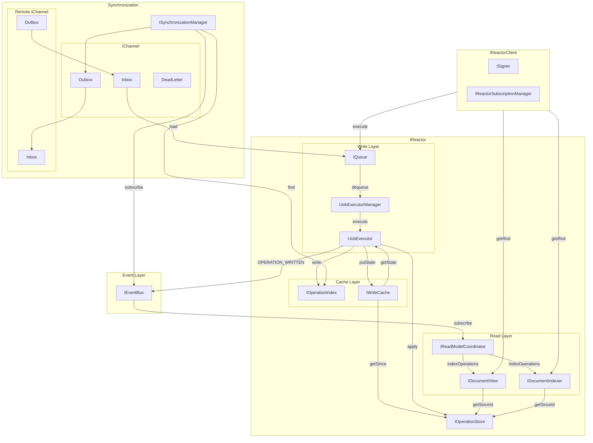

# Reactor

## Architecture Overview

## Table of Contents

- [Reactor](Reactor/index.md)
- [ReactorClient](ReactorClient/index.md)
- [Auth](Auth/index.md)
- [Graceful Shutdown](GracefulShutdown/index.md)
- [Scaling](Scaling/index.md)

### Components

- [PHDocument](PHDocument/index.md)
- [Attachments](Attachments/index.md)
- [Operations](Operations/index.md)
- [Queue](Queue/index.md)
- [Events](Events/index.md)
- [Jobs](Jobs/index.md)
- [Processors](Processors/index.md)
- [Subscriptions](Subscriptions/index.md)
- [Storage](Storage/index.md)
- [Synchronization](Synchronization/index.md)
- [GraphQL](GraphQL/index.md)
- [Utils](Utils/index.md)
- [Shared](Shared/index.md)

### Implementation

- [Implementation Plan](implementation-plan.md)
- [Testing Strategy](testing-strategy.md)
