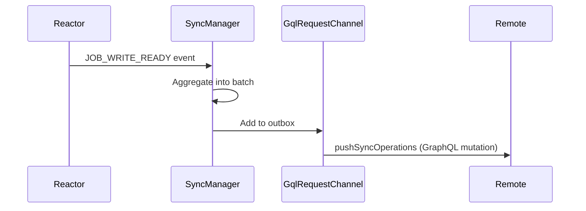
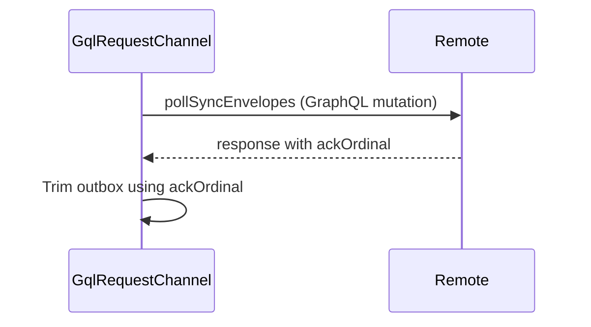
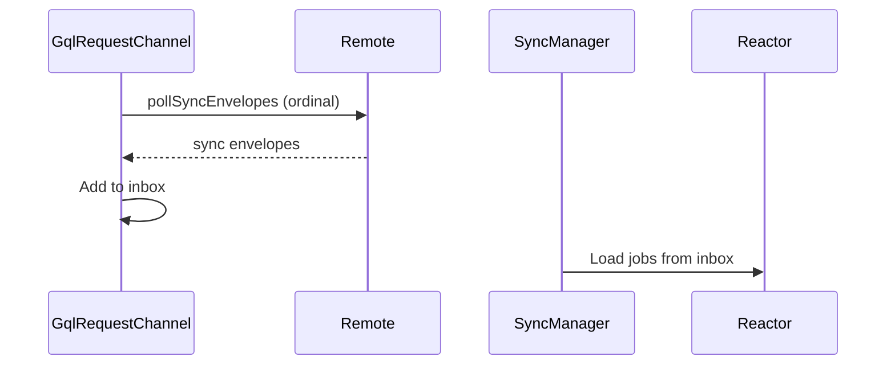
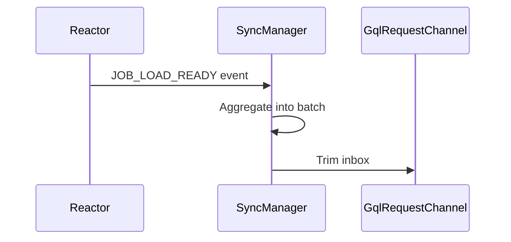
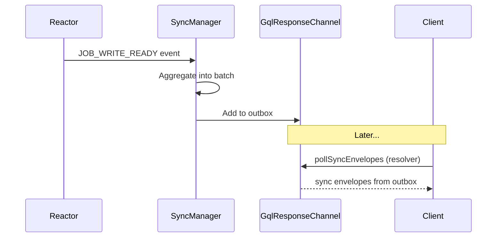
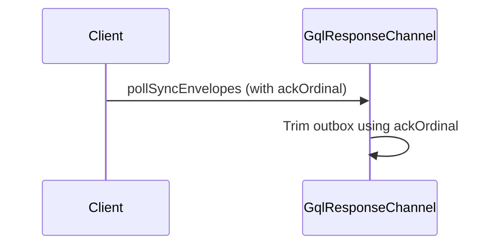
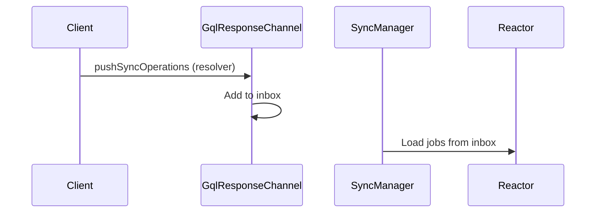
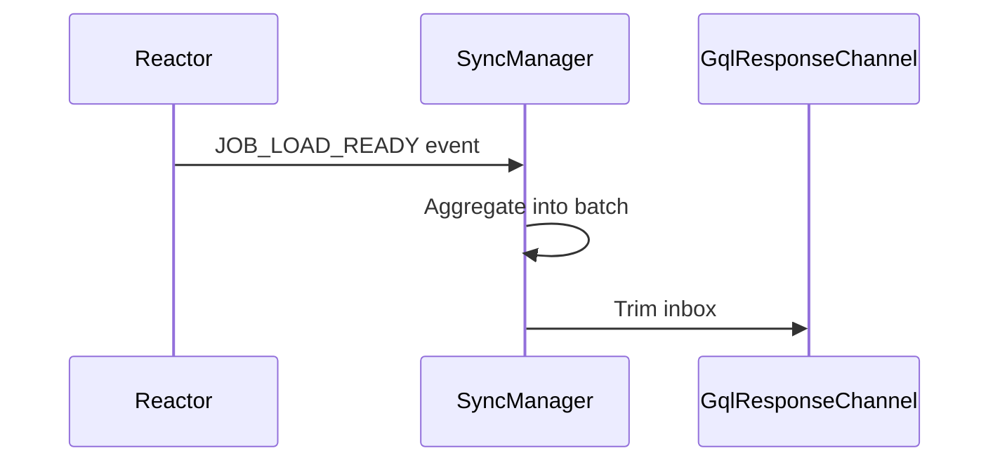

## High Level Gql Sync Design

There are four main flows to handle: Inbox Add, Inbox Remove, Outbox Add, Outbox Remove. These operate differently in Switchboard (GqlResponseChannel) than on Connect (GqlRequestChannel).

### Gql Mutations

#### pushSyncOperations

- Requires only the envelope.
- No cursor updates.

#### pollSyncEnvelopes

##### Request Body

- `channelId` - The ID of the channel to poll.
- `outboxAck` - Used to acknowledge successful application of pulled operations.
- `outboxLatest` - Used to filter operations to return.

##### Response Body

- `envelopes` - A list of sync envelopes.
- `ackOrdinal` - The ordinal to acknowledge successful application of pushed operations.

## GqlRequestChannel

### Outbox

#### Add

1. The reactor fires a JOB_WRITE_READY event.
2. The SyncManager aggregates into batches.
3. When a batch is complete, the SyncManager finds the appropriate remotes and adds to their outboxes.
4. The GqlRequestChannel pushes the batch to the remote via a GraphQL mutation.

#### Remove

1. The pollSyncEnvelopes GraphQL mutation returns an ackOrdinal.
2. The channel trims the outbox using the ackOrdinal.

### Inbox

#### Add

1. The GqlRequestChannel polls the remote for new sync envelopes, using an ordinal.
2. The pollSyncEnvelopes GraphQL mutation returns a list of sync envelopes.
3. The GqlRequestChannel adds the sync envelopes to the inbox.
4. The SyncManager processes the sync envelopes as "load" jobs for the reactor.

#### Remove

1. The Reactor fires a JOB_LOAD_READY event.
2. The SyncManager aggregates into batches.
3. When a batch is complete, the SyncManager finds the appropriate remotes and trims the inbox.

### GqlResponseChannel

### Outbox

#### Add

1. The reactor fires a JOB_WRITE_READY event.
2. The SyncManager aggregates into batches.
3. When a batch is complete, the SyncManager finds the appropriate remotes and adds to their outboxes.
4. Later, the pollSyncEnvelopes GraphQL resolver will return these operations as sync envelopes.

#### Remove

1. The pollSyncEnvelopes resolver takes the ackOrdinal on the client's request and trims the outbox.

### Inbox

#### Add

1. The pushSyncOperations resolver finds the appropriate remotes and adds to their inboxes.
2. The SyncManager processes the sync envelopes as "load" jobs for the reactor.

#### Remove

1. The Reactor fires a JOB_LOAD_READY event.
2. The SyncManager aggregates into batches.
3. When a batch is complete, the SyncManager finds the appropriate remotes and trims the inbox.

