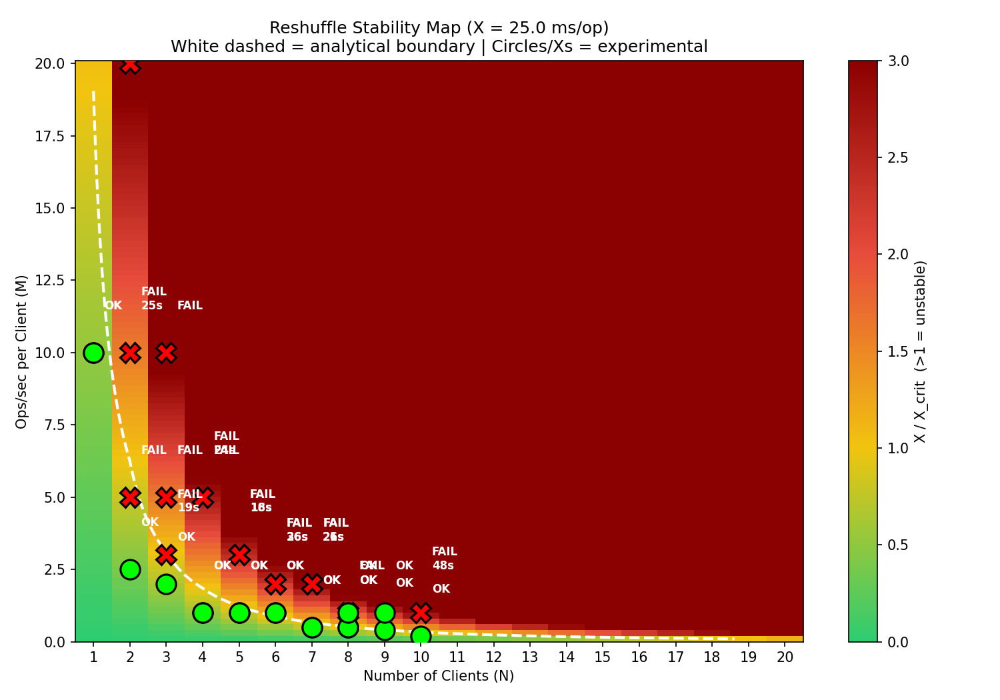
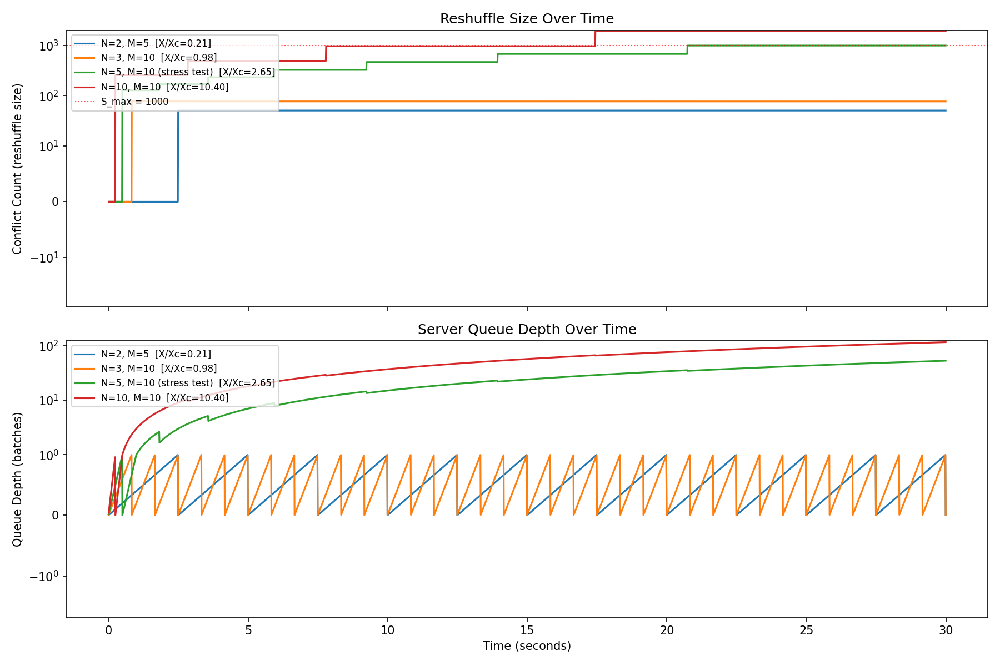
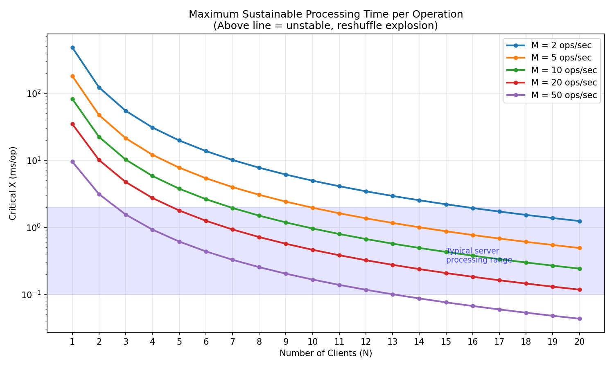
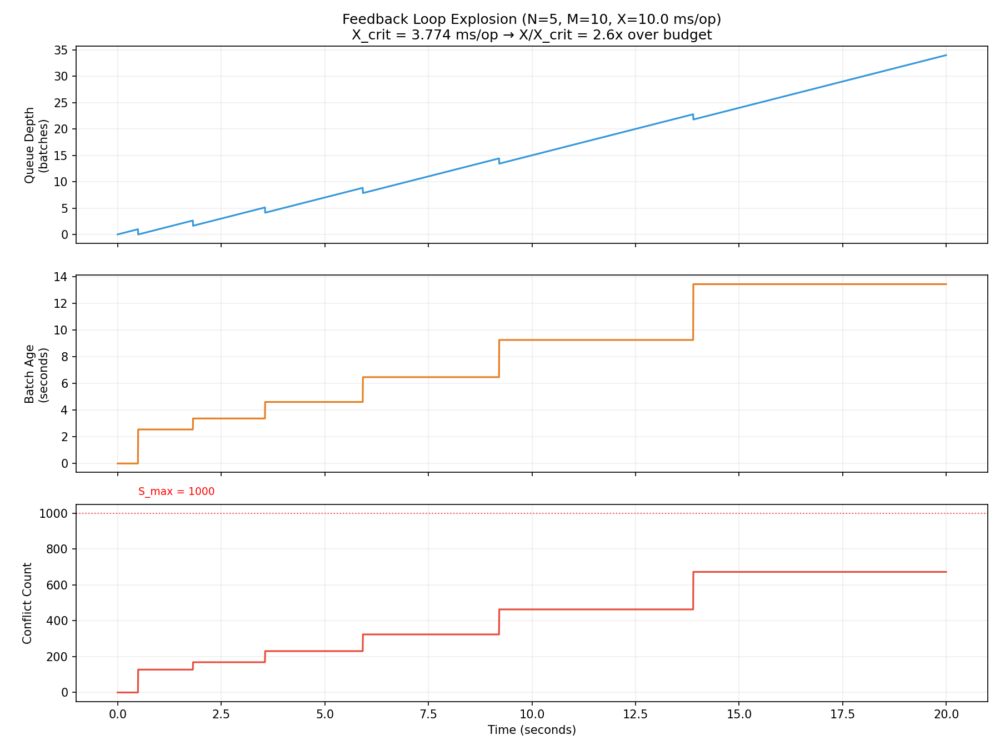

# Reshuffle Growth Dynamics Model

Mathematical model of the positive feedback loop in the reactor sync system that causes "Excessive reshuffle" errors under concurrent load.

## The Problem

When multiple clients push operations concurrently, each incoming batch must be reshuffled against all operations that arrived since its timestamp. This creates a feedback loop:

```
push latency → stale timestamps → wider conflict window → larger reshuffle
    → more processing time → more latency → ...
```

Once the server falls behind, the queue grows, which increases batch age, which increases conflict count, which increases processing time — unbounded growth until the conflict count exceeds `S_max = 1000` and the job fails.

## Running

```bash
cd test/test-connect
python3 -m venv .venv
.venv/bin/pip install numpy matplotlib
.venv/bin/python3 src/reshuffle-model.py
```

## Parameters

| Parameter      | Value  | Source                                           |
| -------------- | ------ | ------------------------------------------------ |
| B (batch size) | 25     | `BufferedMailbox(500, 25)` in gql-req-channel.ts |
| T_flush        | 500ms  | `BufferedMailbox(500, 25)`                       |
| S_max          | 1000   | `MAX_SKIP_THRESHOLD` in simple-job-executor.ts   |
| T_poll         | 2000ms | gql-req-channel.ts                               |
| RTT            | 50ms   | assumed                                          |
| X (ms/op)      | 10ms   | estimated from stress test failure               |

## Stability Condition

```
X < X_crit = (T_batch * 1000 / N) / (B_eff + N * M * age)
```

Where `age = T_batch + RTT` and `T_batch = max(B/M, 0.5)`.

For the stress test config (N=5, M=10): **X_crit = 3.77 ms/op**.

## Generated Plots

### Stability Heatmap



Stability map in (N, M) space at X=10ms/op. Green regions are stable (server keeps up), red regions are unstable (queue explosion). The white dashed line is the analytical stability boundary. The star marks the stress test configuration (N=5, M=10), which sits well inside the unstable zone.

### Time Series



Time series of conflict count (top) and server queue depth (bottom) for four configurations at X=10ms/op. Stable configs stay flat; unstable configs show monotonically growing conflicts and queue depth. The red dotted line marks S_max=1000.

### Critical X



Maximum sustainable processing time per operation (X_crit) as a function of client count N, plotted for several ops/sec rates M. Any point above its curve is stable; below is unstable. The shaded band shows the typical server processing range. This plot answers: "how fast must the server be to handle N clients at M ops/sec?"

### Queue Explosion



Detailed view of the feedback loop for the stress test config (N=5, M=10, X=10ms/op). Three panels show the coupled dynamics:

- **Queue depth** grows linearly as the server falls behind
- **Batch age** increases in steps as each dequeued batch is older
- **Conflict count** marches toward S_max=1000, at which point the job fails with "Excessive reshuffle"
