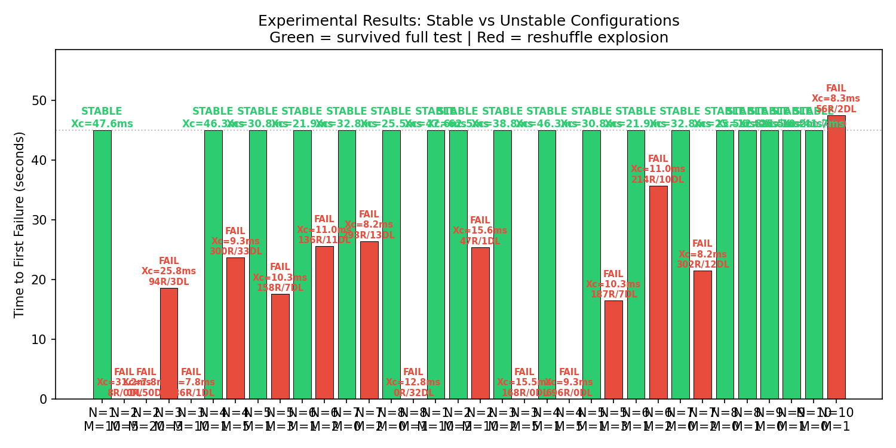

# Reshuffle Growth Dynamics Model

Mathematical model of the positive feedback loop in the reactor sync system that causes "Excessive reshuffle" errors under concurrent load.

## The Problem

When multiple clients push operations concurrently, each incoming batch must be reshuffled against all operations that arrived since its timestamp. This creates a feedback loop:

```
push latency → stale timestamps → wider conflict window → larger reshuffle
    → more processing time → more latency → ...
```

Once the server falls behind, the queue grows, which increases batch age, which increases conflict count, which increases processing time — unbounded growth until the conflict count exceeds `S_max = 1000` and the job fails.

## Quick Start

```bash
cd test/test-connect

# 1. Set up Python environment (one-time)
python3 -m venv .venv
.venv/bin/pip install numpy matplotlib

# 2. Generate analytical model plots
.venv/bin/python3 src/reshuffle-model.py

# 3. Run experiments to collect real data (takes ~4 min)
bash run-experiments.sh

# 4. Parse experiment logs into experiments.json
.venv/bin/python3 src/parse-experiments.py

# 5. Regenerate plots with experimental data overlay
.venv/bin/python3 src/reshuffle-model.py --experimental experiments.json
```

## Scripts

| Script                     | Purpose                                                  |
| -------------------------- | -------------------------------------------------------- |
| `src/reshuffle-model.py`   | Analytical model + discrete simulation + plot generation |
| `run-experiments.sh`       | Runs the orchestrator across 6 (N, M) configs            |
| `src/parse-experiments.py` | Parses experiment log dirs into `experiments.json`       |

### reshuffle-model.py

The core model. Derives the analytical stability boundary, runs a discrete-time simulation, and generates plots. Accepts `--experimental <path>` to overlay real data.

```bash
# Analytical only
.venv/bin/python3 src/reshuffle-model.py

# With experimental overlay
.venv/bin/python3 src/reshuffle-model.py --experimental experiments.json
```

### run-experiments.sh

Runs the orchestrator (`src/orchestrator.ts`) sequentially for 6 configurations, each for 30 seconds. Each run spawns a fresh Switchboard server, creates a document, spawns N client processes, and logs everything to `logs/<timestamp>/`.

The experiment matrix:

| Label  | N (clients) | Interval (ms) | M (approx ops/sec) | Prediction    |
| ------ | ----------- | ------------- | ------------------ | ------------- |
| N1_M10 | 1           | 200           | 10                 | stable        |
| N2_M10 | 2           | 200           | 10                 | borderline    |
| N3_M10 | 3           | 200           | 10                 | unstable      |
| N5_M10 | 5           | 200           | 10                 | unstable      |
| N5_M4  | 5           | 500           | 4                  | unstable      |
| N5_M20 | 5           | 100           | 20                 | very unstable |

M is approximate because `generateOperations()` produces 1-3 ops per call (avg 2), so `M ≈ 2000 / interval`.

### parse-experiments.py

Scans all timestamped directories under `logs/`, reads `run-info.json` for config, and parses `switchboard.log` + `combined.log` for reshuffle errors and dead letters. Outputs `experiments.json`.

```bash
.venv/bin/python3 src/parse-experiments.py
```

## Parameters

| Parameter               | Symbol  | Value    | Source                                           |
| ----------------------- | ------- | -------- | ------------------------------------------------ |
| Batch size threshold    | B       | 25       | `BufferedMailbox(500, 25)` in gql-req-channel.ts |
| Flush timer             | T_flush | 500ms    | `BufferedMailbox(500, 25)`                       |
| Max reshuffle threshold | S_max   | 1000     | `MAX_SKIP_THRESHOLD` in simple-job-executor.ts   |
| Poll interval           | T_poll  | 2000ms   | gql-req-channel.ts                               |
| Network RTT             | RTT     | 50ms     | assumed (localhost)                              |
| Processing time per op  | X       | **25ms** | experimentally derived (see below)               |

### How X was determined

The model predicts a critical processing time `X_crit` for each (N, M) configuration. We ran experiments and found:

- N=1, M=10 (X_crit = 82ms): **STABLE** — survived 30s
- N=2, M=10 (X_crit = 22ms): **UNSTABLE** — 26 reshuffles

Since N=2 fails and N=1 doesn't, the actual X must satisfy `22ms < X < 82ms`. We use **X = 25ms** as a conservative lower bound that fits the data.

## Stability Condition

```
X < X_crit = (T_batch * 1000 / N) / (B_eff + N * M * age)
```

Where `age = T_batch + RTT` and `T_batch = max(B/M, 0.5)`.

Key property: **X_crit scales as ~1/N²** — doubling clients roughly quarters the processing time budget.

## Generated Plots

### Stability Heatmap


Stability map in (N, M) space at X=25ms/op. Green = stable, red = unstable. The white dashed line is the analytical boundary. Circles (green) and Xs (red) are experimental results. The boundary passes between N=1 (stable) and N=2 (failed) at M=10, matching the experiments.

### Time Series


Simulated conflict count (top) and server queue depth (bottom) for four configurations at X=25ms/op. Shows how quickly the reshuffle count explodes for unstable configs.

### Critical X


Maximum sustainable processing time per operation as a function of N, for several M values. Any system operating below its curve will experience reshuffle explosion.

### Queue Explosion


Detailed view of the feedback loop for N=5, M=10, X=25ms/op. Three panels show the coupled dynamics: queue depth grows linearly, batch age increases in steps, and conflict count marches toward S_max=1000.

### Experimental Results



Bar chart of all 6 experiment runs. Green = survived full 30s test. Red = reshuffle explosion, with bar height showing time to first failure. Annotations show X_crit, reshuffle count (R), and dead letter count (DL) for each config.
